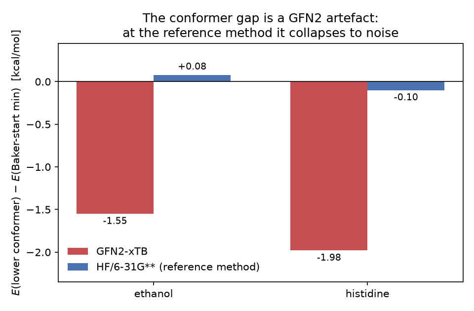

# ethanol & histidine: the "lower minimum" is a GFN2-xTB conformer artefact

*2026-06-20 — investigation of [pyberny#154](https://github.com/jhrmnn/pyberny/issues/154),
follow-up to [#148](https://github.com/jhrmnn/pyberny/issues/148) (report
`2026-06-20-baker-symmetry-saddle`, PR #152).*

**TL;DR.** #148 split the seven noise-flagged Baker molecules into five
symmetry-saddle cases and two *genuine-conformer* cases — ethanol and
histidine — where the no-noise run reaches a real minimum (0 imaginary modes)
that is simply a higher-energy conformer, and a noisy start lands in a lower
basin. This issue asked the one question #148 left open for these two
(its Q3): **does the conformer ordering hold at the paper's HF/6-31G**
reference method, or is it GFN2-specific?** It is GFN2-specific. At HF/6-31G**
the 1.5–2 kcal/mol GFN2 gaps **collapse to ≈0.1 kcal/mol**, and for ethanol
the ordering **reverses** — the bundled Baker-start (anti) reference is
actually the *lower* conformer. So the bundled references are **not**
sub-optimal at the reference method, and no benchmark data should change. This
is ordinary conformer multiplicity amplified by GFN2's conformer-energy error.



## What the two cases are

Both no-noise runs converge to genuine minima (confirmed in the #148 report:
0 imaginary modes in the projected finite-difference Hessian — they are not
saddles). The noise-found structure is a distinct **conformer**, not a
symmetry partner:

| molecule | atoms | Baker-start (`reference_min`) conformer | noise-found (`lower_min`) conformer |
|---|---:|---|---|
| ethanol | 9 | **anti** rotamer, H–O–C–C = 180° (Cₛ, all heavy atoms + OH in a plane) | **gauche** rotamer, H–O–C–C ≈ −64° |
| histidine | 20 | Baker-start side-chain / backbone arrangement | alternative side-chain / backbone rotamer |

For ethanol this is the textbook anti/gauche pair of the hydroxyl torsion;
both are true minima of the OH-rotation potential. For histidine it is one of
the many near-degenerate side-chain/backbone rotamers a 20-atom flexible amino
acid supports.

## The cross-check (issue Q3): GFN2-xTB vs HF/6-31G**

For each molecule I re-optimized from both the `reference_min` and the
`lower_min` geometry at GFN2-xTB (reproducing the #147/#148 gap) and at the
Baker paper's **HF/6-31G** reference method (via PySCF, the same engine
`scripts/benchmark.py` uses). The gap is `E(lower_min basin) − E(reference_min
basin)`; negative means the noise-found conformer is lower.

| molecule | GFN2 gap (kcal/mol) | HF/6-31G** gap (kcal/mol) | at HF the bundled reference is… |
|---|---:|---:|---|
| ethanol | **−1.55** | **+0.08** | the **lower** of the two (ordering reverses) |
| histidine | **−1.98** | **−0.10** | within 0.1 kcal/mol of the alternative |

Raw converged energies (Hartree):

| molecule | method | `reference_min` | `lower_min` |
|---|---|---:|---:|
| ethanol | GFN2-xTB | −11.39186730 | −11.39433932 |
| ethanol | HF/6-31G** | −154.08958513 | −154.08945064 |
| histidine | GFN2-xTB | −34.33890509 | −34.34205918 |
| histidine | HF/6-31G** | −545.55088585 | −545.55104139 |

At HF the two structures remain **distinct** conformers (ethanol stays
anti 180° vs gauche −64° after re-optimization; the energies are not
identical), so the collapse is not the gauche structure relaxing onto anti —
it is that HF simply judges the two conformers near-degenerate. The
1.5–2 kcal/mol separation GFN2 reports is GFN2's well-known tendency to
over/under-stabilize specific conformers by ~1–2 kcal/mol; it is not present
at the reference method.

This is consistent with what the benchmark's own `SOURCE.md` already records:
at HF/6-31G** through PySCF, pyberny "reaches the same minimum the paper found
for every one of the 30 molecules." There was never an energy baseline to
revisit — `reference.json` stores only step counts — and the canonical
HF reference geometry is, for ethanol, the lower conformer outright and, for
histidine, within chemical-accuracy noise of the alternative.

## Answers to the issue's questions

1. **Should the bundled baselines be revisited?** No. The Baker **start**
   geometries are canonical and stay as-is, and `reference.json` carries no
   energy baseline — only `pyberny_steps` / `xtb_gfn2_steps` step counts, which
   correctly measure reaching the start's basin minimum. At the reference
   method that basin minimum is already optimal (ethanol) or degenerate with
   the alternative (histidine), so "minimum of the start's basin" and
   "lowest conformer" coincide to within 0.1 kcal/mol. Nothing to change.
2. **Is this expected conformer multiplicity?** Yes — and benign. Flexible
   molecules have many conformers within ~1 kcal/mol; a local optimizer
   reaching the one in its start's basin is correct behaviour, not a bug.
3. **Does the ordering hold at HF/6-31G**?** No. The gap is GFN2-specific: it
   shrinks from −1.55/−1.98 kcal/mol to +0.08/−0.10 kcal/mol and reverses sign
   for ethanol. This is the decisive result — it removes the only condition
   (#154's recommendation) under which touching the reference data would be
   warranted.
4. **Scope of a conformer pre-scan?** Not warranted. A pre-scan would, at
   best, swap the canonical Baker start for a conformer that is within
   0.1 kcal/mol at the reference method — trading a published, citable start
   geometry for a negligible and method-dependent energy gain. Not worth it.

## Recommendation

Treat as **expected conformer multiplicity** and make **no data change** — in
agreement with #154's starting recommendation and #148's conclusion, now
backed by the HF cross-check. The bundled references are sound at the
reference method.

The durable record is a one-line note in the benchmark `SOURCE.md`: GFN2-xTB
can exaggerate small conformer-energy differences by ~1–2 kcal/mol relative to
the HF/6-31G** reference, so a noisy start occasionally relaxing to a "lower"
GFN2 conformer (e.g. ethanol, histidine) reflects GFN2's conformer energetics,
not a defect in the bundled start geometries or step baselines. (Added on
`master`; this report is the supporting analysis.)

## Files in this report

| file | what it is |
|---|---|
| `README.md` | this report |
| `crosscheck.py` | re-optimizes each start at GFN2-xTB and HF/6-31G** and prints the gap table |
| `hf_geoms.py` | HF/6-31G** re-optimization that saves the optimized geometries and reports the ethanol H–O–C–C torsion (confirming anti/gauche stay distinct) |
| `make_figure.py` | regenerates `conformer_gap.png` from `data/results.json` |
| `conformer_gap.png` | GFN2 vs HF conformer-gap bars |
| `data/results.json` | the energies and gaps tabulated above |
| `data/{ethanol,histidine}_initial.xyz` | bundled Baker start geometry |
| `data/{ethanol,histidine}_reference_min.xyz` | no-noise (GFN2) basin minimum |
| `data/{ethanol,histidine}_lower_min.xyz` | noise-found (GFN2) lower conformer |
| `data/{ethanol,histidine}_{reference,lower}_min_hf.xyz` | the same two conformers re-optimized at HF/6-31G** |

### Reproduce

```sh
# requires the [benchmark] extra (tblite) and pyscf for the HF cross-check
pip install 'pyberny[benchmark]' pyscf matplotlib

python crosscheck.py     # GFN2 vs HF gap table
python hf_geoms.py        # HF-optimized geometries + ethanol torsion
python make_figure.py     # conformer_gap.png
```

The `*_initial.xyz` / `*_reference_min.xyz` / `*_lower_min.xyz` geometries
originate from the #148 noise sweep (branch
`claude/baker-benchmark-noise-stability-rwrj4z`,
`investigations/noise_minima/`); the `*_hf.xyz` files are produced by
`hf_geoms.py` here.
