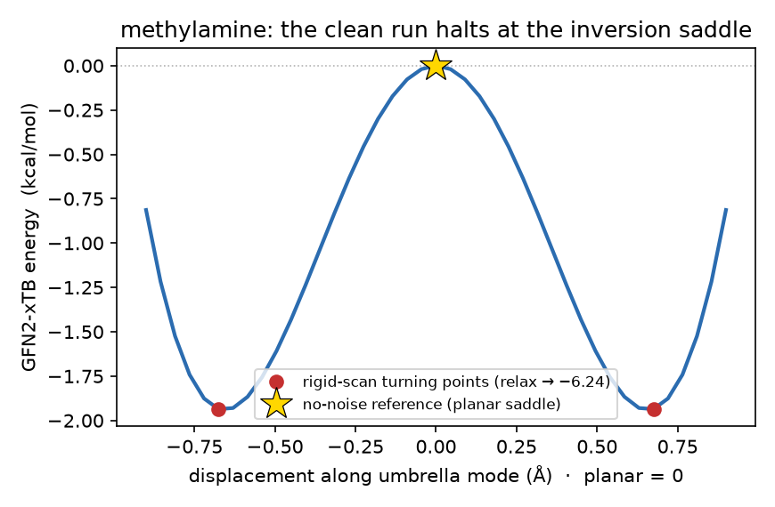
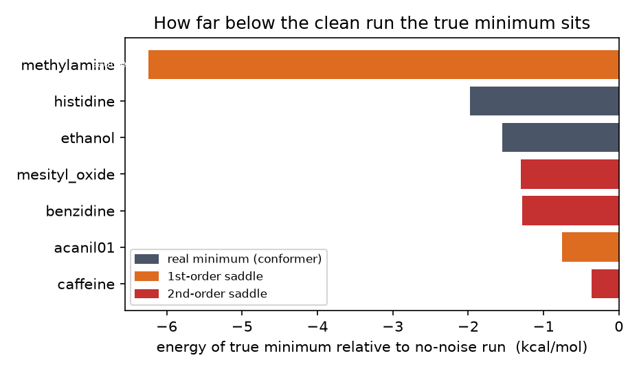

# Why the no-noise Baker runs stop above the true minimum

*2026-06-20 — investigation of [pyberny#148](https://github.com/jhrmnn/pyberny/issues/148)*

**TL;DR.** For five of the seven flagged molecules the unperturbed (no-noise)
optimization does not stop *early on the way to* a minimum — it converges to a
genuine **saddle point**. The Baker reference start geometries for these
molecules are exactly mirror-symmetric, and a gradient-following local
optimizer cannot break exact symmetry: the gradient component along the
symmetry-breaking (imaginary) mode is identically zero, so pyberny descends
within the symmetric subspace to a constrained stationary point that is a
minimum *in that subspace* but a saddle in the full space. The remaining two
molecules (ethanol, histidine) reach a genuine minimum that is simply a
higher-energy conformer. **This is textbook local-optimizer behaviour, not a
pyberny bug**, and it reproduces at the paper's HF/6-31G** reference method.



The figure is the smoking gun for methylamine. Displacing the planar
no-noise reference (gold star) along its single imaginary Hessian mode — the
nitrogen umbrella coordinate — in either direction lowers the energy: it is a
symmetric **double well** whose barrier top is exactly the structure the clean
run converges to. The optimizer is seeded precisely on that barrier top, where
the umbrella gradient is zero by symmetry, and cannot fall off it.

## What the clean run actually converges to

For each flagged molecule I optimized from the bundled Baker start geometry
with GFN2-xTB (reproducing the no-noise run — the converged energies match
the `*_reference_min.xyz` from the noise sweep), then built the Cartesian
Hessian by finite differences of the analytic gradient, projected out the six
translation/rotation modes, and counted the imaginary (negative-curvature)
vibrational modes. The number of imaginary modes is the **order** of the
stationary point: 0 = minimum, 1 = transition state, ≥2 = higher-order saddle.

| molecule | clean E (Ha) | clean gmax | imaginary modes (cm⁻¹) | order | nature | true-min ΔE (kcal/mol) |
|---|---:|---:|---|:--:|---|---:|
| **methylamine** | −7.577238 | 1.3e-4 | **−806** | 1 | planar-N umbrella-inversion TS | **−6.24** |
| **benzidine** | −37.638676 | 1.2e-4 | **−426, −424** | 2 | coplanar-ring saddle | −1.28 |
| **mesityl_oxide** | −21.982156 | 1.9e-4 | **−152, −34** | 2 | planar saddle | −1.30 |
| **caffeine** | −42.153842 | 5.1e-4 | **−67, −21** | 2 | planar-ring saddle | −0.36 |
| **acanil01** | −28.706175 | 3.2e-4 | **−47** | 1 | planar saddle | −0.75 |
| ethanol | −11.391867 | 2.2e-4 | none | 0 | genuine min (higher rotamer) | −1.55 |
| histidine | −34.338905 | 6.9e-5 | none | 0 | genuine min (higher conformer) | −1.98 |



The crucial column is **order**: the gmax values are all comfortably *below*
the `gradientmax = 4.5e-4` threshold (histidine converges at gmax 6.9e-5), so
the clean runs are not halting on a shallow flank with appreciable gradient —
they sit at real stationary points. Five of them are saddles.

## The mechanism, on the clearest case (methylamine)

The Baker start geometry has N, C and both amine hydrogens in a single plane
(the methyl hydrogens form a mirror pair across it) — i.e. a **planar
nitrogen** with an exact Cₛ mirror plane:

```
 N    0.8423  0.0000  0.0000     amine plane z = 0:
 C   -0.5862 -0.0163  0.0000       N, C, H(amine), H(amine) all at z = 0
 H    1.3834 -0.8627  0.0000       the two methyl H at z = ±0.898 mirror
 H    1.3642  0.8727  0.0000       across that plane
 H   -0.9613  1.0222  0.0000
 H   -1.0212 -0.5080  0.8980
 H   -1.0212 -0.5080 -0.8980
```

Planar methylamine is the **umbrella-inversion transition state** of the
amine, not its minimum. Under the start's mirror symmetry the out-of-plane
(pyramidalization) coordinate is antisymmetric, so its gradient is exactly
zero for the whole trajectory; pyberny optimizes only the symmetric in-plane
degrees of freedom and converges to the planar saddle. The Hessian there has a
single imaginary mode at **−806 cm⁻¹** — the umbrella mode. Any displacement
that breaks the mirror (the noise in #147, or a deliberate pyramidalization)
gives that mode a nonzero gradient and the optimizer falls **6.24 kcal/mol** to
the pyramidal minimum (out-of-plane H displaced ~0.8 Å, all-real Hessian).

The same story holds for the other four saddles — the start geometries are
planar / symmetric and the imaginary modes are the out-of-plane
ring/substituent distortions that the symmetry forbids the optimizer from
following.

## It is not a pyberny defect

* **Symmetry conservation is intrinsic to gradient descent.** With a zero
  gradient component along the breaking mode, the RFO/quadratic step has no
  component along it either — *any* purely gradient-driven minimizer (Berny,
  L-BFGS, GDIIS, …) does the same. This is the standard reason
  quantum-chemistry optimizations are seeded slightly off high-symmetry points.
* **pyberny cannot even "see" the negative curvature.** The breaking
  coordinate is never displaced, so the BFGS Hessian update never samples it
  and the approximate Hessian keeps its positive guess value there. There is no
  negative eigenvalue in pyberny's own Hessian to warn on — see the next
  section for the measured numbers and whether this is detectable.
* **Tightening the convergence thresholds would not help.** A saddle is a true
  stationary point: gmax → 0 there. The clean runs already converge at gmax ≪
  threshold; a tighter threshold just converges to the same saddle more
  precisely.

## Why the approximate (BFGS) Hessian never catches it — and can it be detected?

It is worth being precise about *why* the optimizer's own Hessian gives no
warning, because it bears on what (if anything) pyberny could do. BFGS does not
compute curvature; it infers it from the secant condition `H·Δq = Δg` along the
steps actually taken — so it learns curvature **only in directions it has
stepped in**. Because the trajectory stays in the symmetric subspace, the
umbrella coordinate is never displaced (`Δq` has no component along it) and its
gradient is identically zero (`Δg` has none either). Neither side of the secant
equation ever carries information about that direction, so its entry in the
Hessian is frozen at the initial model guess. Measured at the methylamine
saddle (`bfgs_blindness.py`, all values atomic units):

| curvature along the umbrella mode | value | sign |
|---|---:|:--:|
| **true** Hessian (GFN2-xTB) | **−0.082** | negative (−806 cm⁻¹) |
| model **guess** Hessian | +0.0063 | positive |
| converged **BFGS** Hessian | +0.0061 | positive |

The BFGS value is the leftover guess (ratio 0.97 — untouched) with the **wrong
sign**, and the full converged BFGS Hessian has **0 negative eigenvalues**: the
optimizer sees zero gradient *and* a positive-definite Hessian → "minimum,
converged."

**Can "no gradient information here" be detected automatically? Yes.** The
directions BFGS learned about are spanned by the steps `{Δq}`; anything in the
orthogonal complement got nothing and still holds the guess value. For
methylamine the run took **4 steps in 15 internal DOF**, so ≥ **11 directions
received no curvature information at all** — trivially computable from the
accumulated steps (or, a priori, from a point-group/irrep analysis: the
gradient is symmetry-zero along every non-totally-symmetric irrep, which are
exactly the blind directions). The umbrella mode is one of them, as its
untouched-guess curvature confirms.

**But detection is not escape.** Even knowing the direction and its negative
curvature, a *minimizer* still takes a null step there: the Newton/RFO
component is `g/λ = 0/λ = 0` because the gradient is exactly zero by symmetry.
So the only way out is to inject a finite symmetry-breaking displacement and
re-optimize — detection tells you *where to poke and whether to bother*; the
poke is mandatory. The established remedies follow directly: (1) don't seed the
optimizer exactly on a symmetry element; (2) verify a converged minimum with a
frequency (Hessian) calculation and, if an imaginary mode appears, distort
along it and re-optimize — the standard "characterise the stationary point"
protocol; a partial Hessian in just the suspect/unsampled directions suffices.

## Method independence (does the gap appear at HF/6-31G**?)

Yes. Re-running methylamine at the Baker paper's **HF/6-31G**** reference
method with pyberny (via PySCF):

| start | converged E (Ha) | N out-of-plane | ΔE vs planar |
|---|---:|---:|---:|
| planar Baker start | −95.213049 | 0.000 Å | — |
| symmetry-broken (3 seeds) | −95.221628 | 0.817 Å | **−5.38 kcal/mol** |

The planar start halts at the planar saddle; any broken start drops
5.38 kcal/mol to the pyramidal minimum — the GFN2 6.24 kcal/mol gap is not a
GFN2 or pyberny artefact but the intrinsic amine-inversion barrier, present at
the reference method too. (Amine inversion is a saddle at essentially all
electronic-structure methods.)

## Answers to the issue's questions

1. **Genuine higher stationary point, or early stop on the flank?** Genuine
   stationary point. 5/7 are true saddles (imaginary modes confirmed); 2/7
   (ethanol, histidine) are genuine minima that are higher conformers. The
   multi-criterion test is *not* firing early on an appreciable gradient — the
   gradients are real and small.
2. **Symmetry / soft-mode effect?** Yes for the five saddles: the start is
   exactly mirror-symmetric and the imaginary mode is the symmetry-breaking
   coordinate (planar-N umbrella for methylamine/acanil01; out-of-plane
   ring/substituent for benzidine/mesityl_oxide/caffeine). ethanol/histidine
   are ordinary conformer differences, not symmetry.
3. **Tighter thresholds or a random kick?** Tighter thresholds: no (the saddle
   is stationary). A symmetry-breaking kick at apparent convergence: yes — that
   is exactly what the #147 noise does and what escapes the saddle. It should
   *not* be added to the optimizer by default (see below).
4. **Specific to GFN2-xTB?** No — demonstrated method-independent at HF/6-31G**.
5. **Are the bundled references sub-optimal?** Yes: the `reference_energy` /
   step baselines for these molecules correspond to saddle points (5) or higher
   conformers (2), so they sit above the true minima.

## Recommendation

This is expected local-optimizer behaviour, so **no change to the optimizer is
warranted**. In particular, do **not** add an automatic random "kick" at
convergence: it would make results nondeterministic for every user to paper
over a property of a handful of symmetric *start geometries*. Users who want to
confirm a minimum should do a frequency check or restart from a perturbed
geometry — which is what `classify_noise_minima.py` automates.

The one optimizer-side change that *would* be defensible is a **deterministic
warning**, not an action: at convergence, flag when low-curvature directions
received no secant information (the rank-deficiency check above, or a
point-group/irrep test). That would let a symmetry-trapped saddle announce
itself ("converged, but N soft directions were never sampled — verify with a
frequency calculation or a perturbed restart") without changing any result or
adding nondeterminism. It is optional and out of scope here, but it is the
honest middle ground between silently returning the saddle and silently
randomising the input.

For the **benchmark data**, the clean choice (a maintainer call, deliberately
not done here) is to de-symmetrize the affected *start geometries* — a tiny
pyramidalization / out-of-plane twist so the optimizer is not seeded exactly on
a symmetry element — and regenerate the `pyberny_steps` / `xtb_gfn2_steps`
baselines and reference energies from the resulting true minima. Changing the
optimizer or loosening tolerances to chase these numbers is the wrong lever.

A one-line note in the benchmark/algorithm docs ("symmetric start geometries
can converge to a symmetric saddle; this is intrinsic to gradient-based
minimization") would save the next person this investigation.

## Files in this report

| file | what it is |
|---|---|
| `README.md` | this report |
| `classify_noise_minima.py` | reproducible classifier: optimizes each Baker start with GFN2-xTB, projects out translation/rotation, counts imaginary modes, and shows the symmetry-break recovery |
| `bfgs_blindness.py` | shows, from the optimizer's own state, why the BFGS Hessian stays positive-definite at the saddle and that the blind direction is detectable |
| `make_figure.py` | regenerates the two figures below from `data/` |
| `inversion_doublewell.png` | methylamine umbrella-inversion double well (saddle at the top) |
| `energy_gaps.png` | per-molecule drop to the true minimum, coloured by stationary-point order |
| `data/methylamine_reference_min.xyz` | planar saddle the no-noise run reaches |
| `data/methylamine_lower_min.xyz` | pyramidal true minimum a noisy start reaches |

### Reproduce

```sh
# requires the [benchmark] extra (tblite) and, for the HF cross-check, pyscf
pip install 'pyberny[benchmark]' matplotlib

python classify_noise_minima.py      # the classification table
python bfgs_blindness.py             # why the BFGS Hessian stays positive-definite
python make_figure.py                # the two figures
```

Full per-molecule reference geometries (`*_initial.xyz`, `*_reference_min.xyz`,
`*_lower_min.xyz`) are committed on branch
`claude/baker-benchmark-noise-stability-rwrj4z` under
`investigations/noise_minima/`; the noise sweep that surfaced the effect is
`scripts/baker_noise_stability_findings.md` there.
