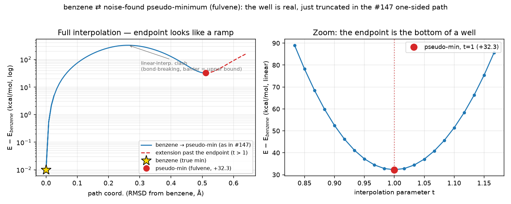

# Issue #149 — the benzene "pseudo-minimum" is fulvene, a genuine C₆H₆ isomer

**TL;DR.** The structure pyberny reports as converged ~+32 kcal/mol above
planar benzene is **not a spurious convergence and not a saddle point**. A
finite-difference Hessian shows it is a genuine GFN2-xTB **minimum** (all-real
vibrational frequencies). The structure is **fulvene**
(5-methylenecyclopenta-1,3-diene), the best-known C₆H₆ structural isomer,
whose experimental enthalpy is ~+33 kcal/mol above benzene — matching the
observed +32.3 kcal/mol. The 0.3 Å RMS Cartesian noise was large enough to
break one ring C–C bond and form the exocyclic methylene, dropping the start
geometry into fulvene's basin, from which pyberny correctly optimized to
fulvene's minimum. The first-order convergence test is working as designed;
there is no optimizer defect here, and the curvature guard proposed in the
issue would *not* reject this structure because it really is a minimum.

Reproduce (run from this report's folder; needs the `[benchmark]` extra for
`tblite` and `pyscf`):

```sh
./freq_analysis.py        # GFN2-xTB finite-difference Hessian / frequencies
./hf_crosscheck.py        # HF/pyscf re-optimization + Hessian cross-check
```

Inputs alongside the scripts: `benzene_initial.xyz` (Baker reference start),
`benzene_reference_min.xyz` (planar D6h minimum) and `benzene_pseudo_min.xyz`
(the noise-found structure), all carried over from the PR #147 noise-stability
sweep.

## 1. Is it a minimum or a saddle point? → genuine minimum

Finite-difference Hessian (central differences of the analytic GFN2-xTB
gradient, translations/rotations projected out, `freq_analysis.py`):

| structure | E (Ha) | lowest 3 frequencies (cm⁻¹) | imaginary modes | verdict |
|---|---:|---|---:|---|
| reference (planar D₆ₕ benzene) | −15.87964055 | 368.4, 368.4, 579.2 | 0 | minimum |
| pseudo-minimum (noise-found) | −15.82822046 | 178.7, 333.6, 456.9 | **0** | **minimum** |

Both are genuine minima. The pseudo-minimum has **no** imaginary frequencies —
its lowest real mode is ~179 cm⁻¹. So the gradient criterion is not being
fooled by a saddle point; the optimizer landed on a real, distinct minimum of
the PES. (The reference's doubly-degenerate 368 cm⁻¹ pair is the expected D₆ₕ
e₂ᵤ out-of-plane benzene mode — a good all-real control.)

This also explains why it converges *tighter* than benzene (gmax 2.3e-5 vs
1.4e-4): nothing pathological is happening; it is simply a different local
optimization that happened to drive the gradient further down.

### Aside: why the #147 interpolation path shows a ramp, not a well

The benzene panel of `minima_paths.png` (#147) plots a linear-Cartesian
interpolation from benzene (`t=0`) to the noise-found structure (`t=1`) and
*stops* at `t=1`, so the pseudo-minimum appears as the end of a steep ramp with
no visible well — which is what prompted the "doesn't look like a minimum"
worry. But an **endpoint of a one-sided path can never render as a well**: you
only ever see the approach side, so *any* minimum sampled this way looks like
the top of a ramp. Extending the *same* straight line past the endpoint
(`t>1`, GFN2-xTB, energies relative to benzene) shows the dip is really there:



*Left:* the full Kabsch-aligned interpolation (as in #147) on a log scale — the
solid curve descends into the pseudo-minimum and the dashed extension (`t>1`)
climbs straight back out. *Right:* a linear zoom on the basin — a clean
parabolic well whose minimum is exactly the endpoint. Regenerate with
`./interpolation_plot.py`.

**The stationary-point signature is there — it is just under-resolved.** The
motivating worry was sharper than "no well": at *any* stationary point the
gradient is zero, so its projection onto *any* direction — including the
interpolation line — must vanish, and the energy-vs-path curve must flatten to
zero slope at the node. Measuring the slope `dE/ds` (kcal/mol per Å of path)
and the gradient along the line shows exactly that:

| `t` | 0.90 | 0.97 | **1.00 (pseudo-min)** | 1.03 | 1.10 |
|---|---:|---:|---:|---:|---:|
| E − E$_{benzene}$ (kcal/mol) | 52.5 | 34.1 | **32.3** | 34.0 | 51.4 |
| gmax (Ha/bohr) | 1.6e-1 | 4.5e-2 | **2.3e-5** | 4.7e-2 | 1.7e-1 |
| slope dE/ds (kcal·mol⁻¹·Å⁻¹) | −802 | −233 | **+0.1** | +227 | +747 |

The slope passes cleanly through **zero at the endpoint** (−233 → +0.1 → +227,
a sign change) and the gradient collapses to gmax = 2.3e-5 there — a textbook
stationary point. So the point *is* stationary and the curve *does* flatten at
it. The #147 panel fails to show this for two mundane reasons, not because the
point is non-stationary: (1) the path **terminates at the node**, so only the
large-slope approach side (`t<1`) is drawn and the zero-crossing is never
reached on the plot; and (2) the turnover lives in the **final, unsampled
sub-segment** — at #147's 16-points-per-segment resolution the energy moves
< 2 kcal/mol over the last ~3 % of the path, sub-pixel on a log axis near
30 kcal/mol. Sampling finely near the node and continuing past it (the figure
above) resolves the flattening; measuring the gradient settles it outright. The
rigorous minimum-vs-saddle statement is the Hessian below.

## 2. What is the structure? → fulvene (not puckered benzene)

The pseudo-minimum is **planar** (best-fit-plane out-of-plane RMS ≈ 1e-4 Å),
so it is *not* a ring-puckered benzene. Connectivity analysis (bonds within
1.3× the sum of covalent radii — the same rule pyberny uses to build internal
coordinates) shows the carbon skeleton has been rearranged:

```
   pseudo-min carbon graph        benzene carbon graph
        C1(H2)                       C–C–C
        ‖ (exocyclic CH2)           /     \
        C5                         C       C   (6-ring, all C–C 1.385 Å)
       /  \                         \     /
      C3    C4                       C–C–C
      |      |
      C0 —— C2     (5-membered ring: C5-C3-C0-C2-C4)
```

- **C5** is the ipso carbon: 3 C–C bonds (to C1, C3, C4), **no H**.
- **C1** is the exocyclic methylene carbon: 1 C–C bond (to C5) + **2 H**.
- The other four carbons form the diene ring, one H each.
- Ring C–C bonds alternate (≈1.34 Å double / ≈1.46 Å single), the
  cyclopentadiene-ring + exocyclic-double-bond pattern of fulvene; benzene's
  are uniform 1.385 Å.

That is exactly **fulvene, C₆H₆**. It is reached because the 0.3 Å RMS noise
(~0.52 Å per-atom displacement) is large enough to rupture one aromatic C–C
bond and let the freed CH migrate into the exocyclic methylene — a connectivity
change, after which pyberny rebuilds internal coordinates for the *new* graph
and optimizes fulvene normally.

## 3. Why does the convergence test accept it? → because it is correct

The redundant-internal-coordinate convergence test is a **first-order
stationary-point test**: it checks gradient RMS/max and step RMS/max
(`is_converged`, `src/berny/berny.py`). It contains no curvature information by
design. There is **no degenerate or ill-defined internal coordinate** at the
fulvene geometry — the bond graph is clean (every C is 3-connected, every H
1-connected), so pyberny builds a perfectly well-defined internal-coordinate
system for fulvene and converges it to a true minimum.

In other words, the test is not being "fooled". It correctly certifies a
first-order minimum; that minimum simply is not the *global* one. Locating the
global minimum from an arbitrary start is outside the contract of a local
optimizer.

## 4. xTB-specific, or also HF? → general (fulvene is a real isomer everywhere)

Fulvene is a genuine molecule, a minimum on essentially every electronic-
structure surface, so this is not an artefact of GFN2-xTB's smooth PES. Driving
pyberny with the **pyscf RHF solver** from the benzene and fulvene geometries
(`hf_crosscheck.py`, HF/3-21G):

| structure | HF/3-21G E (Ha) | converged | lowest HF freq (cm⁻¹) |
|---|---:|---:|---:|
| benzene | −229.419445 | yes | — |
| fulvene | −229.354351 | yes | **226.3 (real)** |

`fulvene − benzene = +40.8 kcal/mol` at HF/3-21G (vs +32.3 at GFN2-xTB; the
two methods need not agree quantitatively, but both place fulvene clearly above
benzene). A finite-difference HF Hessian at the HF-optimized fulvene gives a
lowest real frequency of 226 cm⁻¹ — **no imaginary modes**, a genuine HF
minimum as well.

The fulvene structure remains a separately converged minimum on the HF surface
with the same benzene-below-fulvene ordering, confirming the phenomenon is a
property of the chemistry (a neighbouring real isomer reachable by a large
displacement), not of the solver.

## 5. Should Berny guard against this? → no curvature gate; it would not help

The issue floats an optional "lowest-Hessian-eigenvalue sanity check at
apparent convergence". **That guard would not reject this structure**, because
fulvene *is* a minimum (all eigenvalues positive). It would only ever catch
genuine saddle-point convergence, which is *not* what happens here, while
adding a full Hessian evaluation (3N gradient calls) to every optimization.
For the cost it buys nothing on this failure mode.

The honest characterization is: this is **expected physics, not an optimizer
bug**. At 0.3 Å RMS the start geometry no longer corresponds to benzene's
connectivity, and the optimizer faithfully finds the minimum of the basin it
was dropped into. The only thing that "changed" is the molecular graph, so the
*targeted* diagnostic — if one is wanted at all — is a **connectivity-change
warning** (compare the bond graph at convergence against the input graph and
warn if it differs), not a curvature gate. That is cheap, catches exactly this
"the optimizer silently changed what molecule you have" surprise, and produces
no false positives on conformers that keep their connectivity.

Recommendation: **do not add a Hessian/curvature convergence guard for this
case.** Treat the +19…+93 kcal/mol benzene family from PR #147 as what it is —
the optimizer correctly converging to neighbouring C₆H₆ isomers (fulvene and
relatives) after extreme noise broke the ring — and, if desired, add an
optional post-optimization connectivity-change notice rather than changing the
convergence criteria.
