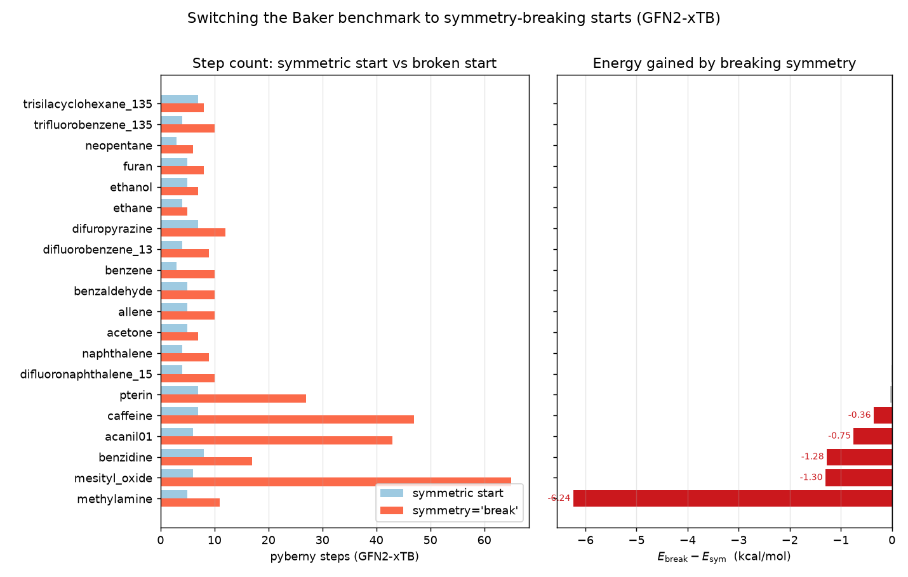

# Switching the benchmarks to symmetry-breaking starts: what it would cost

*2026-06-21 — follow-up to [pyberny#148](https://github.com/jhrmnn/pyberny/issues/148)
and [#162](https://github.com/jhrmnn/pyberny/pull/162); the switch was prototyped
in [#164](https://github.com/jhrmnn/pyberny/pull/164) and decided against*

**TL;DR.** #162 added the opt-in `Berny(symmetry='break')` kick that displaces an
exactly symmetric start off its symmetry elements so a gradient optimizer is no
longer trapped on a symmetric saddle. The open question was whether the benchmark
runners (`scripts/benchmark.py`, both the xtb and pyscf paths) should turn it on
by default. This report measures what that switch would do, so the call can be
made on data. **The switch is not being taken** — the effect is concentrated
almost entirely in the **Baker** set, where turning the flag on would force a
re-seed of 21 baselines and bank some expensive descents, for a payoff (six
genuinely lower minima) that #162 already exposes as an opt-in. The breakdown:

- **birkholz**: *no change at all.* All 19 start geometries are already `C1`, and
  `break_symmetry` returns a `C1` geometry unchanged, so every step count and
  energy would be bit-identical to today.
- **oligomers**: *one molecule would change.* 90 of 91 starts are `C1`; only
  `polypropylene_n1` (Cₛ) moves — 3 → 7 steps to the **same** minimum
  (ΔE = −0.0008 kcal/mol).
- **baker**: 23 of 30 starts are symmetric. 16 would drift past the ±7 %
  (floor-2) regression gate. Six descend to a genuinely **lower** minimum (the
  #148 saddles); the other ten re-converge to the *same* energy but cost more
  steps.



## What the switch would change

```python
# scripts/benchmark.py — xtb path
berny = Berny(geom, trace=trace, symmetry='break')
# pyscf path: kwargs forwarded through pyscf's berny_solver.kernel
kwargs = {'symmetry': 'break'}
```

The references in each `reference.json` (`xtb_gfn2_steps`) were measured on the
**un-broken** starts, i.e. on the symmetric-saddle convergence — which is what
the benchmark still does today. They are the right "before" baseline to diff
against, so the tables below compare a `symmetry='break'` run directly to them.

## birkholz: untouched

All 19 Birkholz–Schlegel molecules are drug-like and asymmetric (`C1`) as
shipped — including `mg_porphin`, whose start is a puckered, non-planar
porphyrin rather than the idealized D₄ₕ. `break_symmetry` no-ops on `C1`
(MolSym finds no non-totally-symmetric SALCs; the geometry is returned
unchanged), so the entire set is bit-identical with and without the flag. The
push/PR auto-trigger's `birkholz xtb` shards would stay green.

## oligomers: one Cₛ molecule

Of the 91 oligomers, only `polypropylene_n1` is symmetric (Cₛ). Breaking it
takes the optimizer from 3 to 7 steps to reach essentially the same structure
(ΔE ≈ −0.001 kcal/mol) — a symmetric **minimum**, not a saddle, so the extra
steps buy nothing but the detour off the mirror plane and back. It would trip the
gate (3 → 7, tol 2). The two oligomer non-convergers seen in CI
(`PPE_n8`, `nylon6_n5`) fail **with and without** the flag and are unrelated to
symmetry.

## baker: the interesting set

| molecule | pg | ref steps | break steps | ΔE (kcal/mol) | gate |
|---|---|---:|---:|---:|---|
| methylamine | Cₛ | 5 | 11 | **−6.24** | FAIL |
| mesityl_oxide | Cₛ | 6 | 65 | **−1.31** | FAIL |
| benzidine | D₂ | 8 | 17 | **−1.28** | FAIL |
| acanil01 | Cₛ | 6 | 43 | **−0.75** | FAIL |
| caffeine | Cₛ | 7 | 47 | **−0.36** | FAIL |
| pterin | Cₛ | 7 | 27 | **−0.03** | FAIL |
| difluoronaphthalene_15 | C₂ₕ | 4 | 10 | −0.002 | FAIL |
| naphthalene | D₂ₕ | 4 | 9 | −0.001 | FAIL |
| benzene | D₆ₕ | 3 | 10 | ~0 | FAIL |
| trifluorobenzene_135 | D₃ₕ | 4 | 10 | ~0 | FAIL |
| allene | D₂d | 5 | 10 | ~0 | FAIL |
| benzaldehyde | Cₛ | 5 | 10 | ~0 | FAIL |
| difluorobenzene_13 | C₂ᵥ | 4 | 9 | ~0 | FAIL |
| difuropyrazine | C₂ₕ | 7 | 12 | ~0 | FAIL |
| furan | C₂ᵥ | 5 | 8 | ~0 | FAIL |
| neopentane | Td | 3 | 6 | ~0 | FAIL |
| acetone | C₂ᵥ | 5 | 7 | ~0 | pass |
| ethanol | Cₛ | 5 | 7 | ~0 | pass |
| ethane | D₃d | 4 | 5 | ~0 | pass |
| trisilacyclohexane_135 | C₃ᵥ | 7 | 8 | ~0 | pass |
| ammonia | C₃ᵥ | 4 | 4 | ~0 | pass |
| water | C₂ᵥ | 4 | 4 | ~0 | pass |
| disilyl_ether | C₂ᵥ | 16 | 16 | ~0 | pass |
| *(7 × C₁)* | C₁ | — | = ref | 0 | pass |

Two distinct populations:

1. **Saddle escapers (six molecules).** methylamine, mesityl_oxide, benzidine,
   acanil01, caffeine, pterin sit on symmetric saddles as shipped — exactly the
   structures the #148 root-cause report identified by their imaginary Hessian
   modes. Breaking the symmetry lets the optimizer fall off the saddle to the
   true minimum, recovering up to 6.24 kcal/mol. The ΔE values reproduce the
   #148 issue table to the digit. With the flag on, the benchmark would measure
   convergence to a *minimum* rather than to a saddle.

2. **Symmetric minima (the rest of the non-C₁ set).** benzene, naphthalene,
   water, ammonia, ethane, etc. were already at genuine minima that happen to be
   symmetric. Breaking them only kicks the geometry off the symmetry element and
   makes the optimizer walk back — same final energy (ΔE ≈ 0), more steps.

The step-count cost of the descent is uneven. The saddle escapers can be
expensive: mesityl_oxide 6 → 65, caffeine 7 → 47, acanil01 6 → 43 — the
post-saddle basin is shallow and the path long. The symmetric minima are
cheaper (typically +3 to +6 steps) but still bust the ±7 % / floor-2 gate
because the baselines are so small.

## Why the benchmark keeps the flag off

Turning on symmetry-breaking is a deliberate, deterministic behaviour change, so
the 16 baker gate failures (and the one oligomer) it produces are **expected**,
not flaky — they are not the GFN2-xTB runner-to-runner step jitter the project
policy tells us to ignore. With the flag on, the shipped `xtb_gfn2_steps`
baselines would no longer describe what the benchmark does: they were measured
against symmetric-saddle convergence, which for six molecules is convergence to
the *wrong* stationary point. Switching the default would therefore mean
re-seeding 21 baselines (20 baker + `polypropylene_n1`) against the broken-start
runs.

That re-seed is what #164 prototyped, and it is the part the maintainer decided
**not** to take. The chosen disposition is to leave the benchmark runners on the
as-shipped (symmetric) starts and keep `symmetry='break'` as the user-facing
opt-in that #162 already provides:

- The benchmark's job is regression tracking — flagging when a code change moves
  step counts — and the existing baselines do that job correctly against a fixed,
  reproducible set of starts. Re-seeding them to broken starts trades a clean
  regression signal for a one-time honesty gain that #162 already makes available
  to any user who wants it.
- The six saddle escapers are a real finding worth recording (this report), but
  they are an argument for the `symmetry='break'` *option*, not for changing what
  the benchmark measures by default.
- The descents are uneven and, in places, expensive (mesityl_oxide 65, caffeine
  47, acanil01 43 steps). Baking those into the baselines would bank a cost we
  have not yet shown is the *honest* cost — whether 40–65 steps reflects the true
  basin geometry or a kick (the 0.02 Å floor) that drops the optimizer onto a
  needlessly long path is unresolved. Better to leave the baselines untouched
  than to enshrine numbers that might just be measuring a suboptimal kick.

So the net change to the package is **none**: #162's opt-in stays, the benchmark
keeps its current baselines, and this report stands as the record of what the
switch would have cost and why it was not worth it.

## Reproduce

```bash
pip install -e '.[benchmark]'
git submodule update --init external/oligomer-benchmarks   # oligomers only
python make_figure.py                                      # redraws from data/results.json
```

`data/results.json` holds the measured per-molecule step counts (symmetric vs
broken start) and final GFN2-xTB energies for all three sets. It was produced by
running each molecule twice — `Berny(symmetry=None)` and `Berny(symmetry='break')`
— under `berny.solvers.XTBSolver` (GFN2-xTB, charge/multiplicity from each set's
`reference.json`). birkholz and the C₁ oligomers are recorded as no-ops, which
their `C1` point group guarantees.
