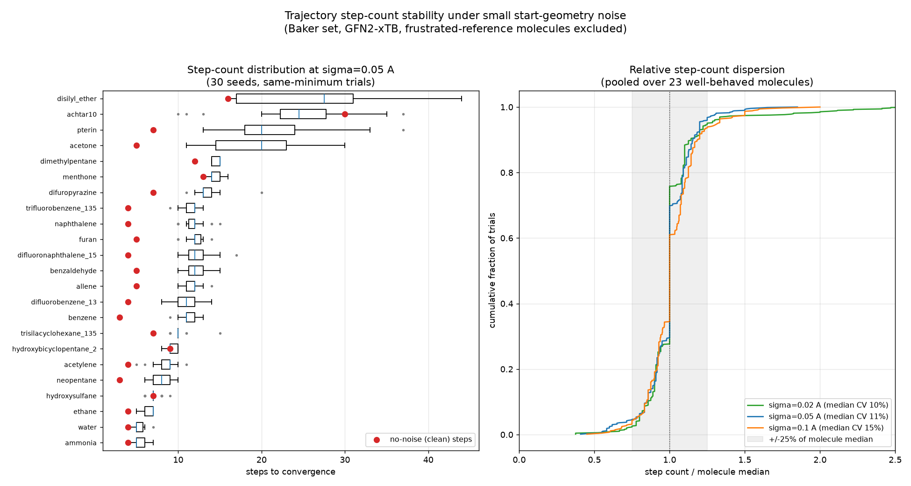
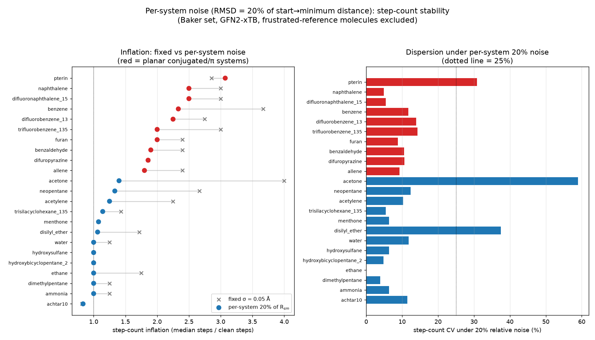

# Step-count stability of pyberny trajectories under small start-geometry noise

*2026-06-22 — follow-up to the
[`2026-06-20-baker-noise-stability`](../2026-06-20-baker-noise-stability) report.*

The parent study established that pyberny's *located minimum* is stable to small
Cartesian noise in the start geometry (≈82 % of trials return to the same
minimum, ≈94 % within 2 kcal/mol). It left a separate question open: even when a
slightly perturbed start converges to the **same** minimum, is the **number of
optimization steps** stable, or does the trajectory length scatter?

This matters because the benchmark grades pyberny on step counts (`pyberny_steps`
/ `xtb_gfn2_steps`), so step-count reproducibility under tiny geometric
perturbations is exactly the kind of robustness the regression gate assumes.

## Method

For every Baker molecule **except the seven "frustrated reference" molecules** —
`methylamine`, `mesityl_oxide`, `benzidine`, `acanil01`, `caffeine`, `ethanol`,
`histidine` — whose unperturbed start sits on/near a symmetric saddle and which
therefore relax to a *different* minimum under any noise (see the
[`baker-symmetry-saddle`](../2026-06-20-baker-symmetry-saddle) and
[`baker-ethanol-histidine-conformer`](../2026-06-20-baker-ethanol-histidine-conformer)
reports and [pyberny#148](https://github.com/jhrmnn/pyberny/issues/148)):

1. optimize the clean start (GFN2-xTB) → reference step count `N0`;
2. optimize **30 noisy copies** at each amplitude σ ∈ {0.02, 0.05, 0.1} Å (RMS
   per Cartesian coordinate);
3. keep only trials that converge to the **same minimum** (final energy within
   0.1 kcal/mol of the clean run) and record their step counts.

23 molecules × 3 amplitudes × 30 seeds. Scripts in `scripts/`, raw data in
`data/step_stability.json`, figure `step_count_stability.png`.



## Result: stable per molecule, but noisier than the minimum

**Conditioned on the molecule and on reaching the same minimum, the step count
is tight and bounded:**

| σ (Å) | median per-molecule CV | trials within ±25 % of molecule median |
|---:|---:|---:|
| 0.02 | 10 % | 93 % |
| 0.05 | 11 % | 92 % |
| 0.1  | 15 % | 91 % |

Nothing approaches the 100-step ceiling and there is no heavy tail — even the
worst per-molecule outliers stay ≤1.9× that molecule's median (right panel:
steep ECDFs centred on 1.0). So the *trajectory length* is reproducible to
roughly ±10–15 %, materially noisier than the *minimum* (reproducible to
<0.1 kcal/mol) but still well-behaved.

Two things qualify "stable":

### 1. A systematic inflation off the pre-relaxed starts (not instability)

The Baker start geometries are already very close to their minimum, so the clean
runs are unusually short (3–7 steps for most molecules). Any displacement throws
away that head start, so perturbed runs cost a **near-constant ~2–3× more steps**
— with *tight* spread, i.e. a multiplicative offset, not scatter. Examples at
σ = 0.05 (clean → median): `acetone` 5 → 20 (4.0×), `benzene` 3 → 11 (3.7×),
`naphthalene` 4 → 12 (3.0×), `neopentane` 3 → 8 (2.7×). The lone inversion is
**`achtar10`** (clean = 30, the slowest converger): noise *shortens* it to a
median of 24 (0.8×) — a small nudge knocks it off its long, grinding descent.
Molecules whose clean start is not pre-relaxed to the same degree
(`hydroxybicyclopentane_2`, `hydroxysulfane` ≈1.0×; `menthone` 1.1×) barely
inflate at all.

### 2. A soft-PES minority that genuinely scatters more

Four molecules show CV ≈ 24–30 % at σ = 0.05, with ranges spanning roughly a
factor of two:

| molecule | clean | σ=0.05 median | range | CV |
|---|---:|---:|---:|---:|
| disilyl_ether | 16 | 27 | 16–44 | 30 % |
| acetone | 5 | 20 | 11–30 | 27 % |
| pterin | 7 | 20 | 13–37 | 24 % |
| achtar10 | 30 | 24 | 10–37 | 24 % |

These have flat / soft regions where the path length is genuinely sensitive to
where the perturbed start lands, but even their worst trajectory is only
~1.5–1.9× the median — no blow-up, no non-convergence.

**Amplitude dependence** is mild: the median per-molecule CV grows only from
10 % to 15 % as σ goes 0.02 → 0.1 Å, so the picture is robust across the
small-noise regime.

## Conclusion

Once the saddle-point (frustrated-reference) molecules are excluded and trials
are conditioned on reaching the same minimum, pyberny's trajectories **are
step-count stable** — per-molecule CV ≈ 10–15 %, ~92 % of runs within ±25 % of
the molecule's median, bounded with no ceiling tail. The two caveats are an
*expected* ~2–3× inflation off the benchmark's unusually short pre-relaxed
starts (a tight multiplicative offset, not instability), and a handful of
soft-surface molecules (`disilyl_ether`, `acetone`, `pterin`, `achtar10`) whose
step count is ~25–30 % variable. This is consistent with the regression gate's
7 %-with-a-2-step-floor tolerance being applied to a *fixed* start geometry: the
step counter is reproducible for a given start, and only loosely so across
geometric perturbations of it.

## Noise amplitude in RMSD terms

The fixed σ above is a per-coordinate Gaussian width; the resulting structural
displacement is, on average:

| σ (Å) | raw RMSD (Å) | aligned RMSD (Å) |
|---:|---:|---:|
| 0.02 | 0.035 | 0.031 |
| 0.05 | 0.084 | 0.074 |
| 0.10 | 0.172 | 0.151 |

i.e. **raw RMSD = √3·σ** (each atom's squared displacement averages 3σ²), and
Kabsch-aligned RMSD ≈ 1.5·σ on average (alignment removes the 6 rigid-body DOF;
σ·√(3−6/N), so the reduction is largest for small molecules).

Crucially, the Baker starts are **pre-relaxed**, so the clean start→minimum
RMSD is small — **median 0.053 Å, mean 0.088 Å**, from ~0.01 Å for rigid
molecules (benzene, neopentane, the halobenzenes) up to ~0.25–0.27 Å for the
floppy ones (`disilyl_ether`, `achtar10`, `menthone`). The fixed-σ noise at
σ = 0.05 Å (~0.07 Å RMSD) therefore **exceeds the median start→minimum
distance** — it over-perturbs the most pre-relaxed molecules, which is exactly
why the rigid aromatics with tiny intrinsic distance show the biggest inflation.
(Measured initial→converged RMSD grows 0.09 → 0.15 → 0.20 Å for σ = 0 → 0.05 →
0.1 Å.)

## Refinement: per-system noise = 20 % of the start→minimum RMSD

To remove that over-perturbation confound, the study is repeated with the noise
amplitude **derived per molecule** so the perturbation RMSD is a fixed fraction
of *that molecule's own* start→minimum distance R$_{sm}$: σ = f·R$_{sm}$/√3
(realized noise RMSD ≈ 0.18·R$_{sm}$ at f = 0.2, slightly below the 0.20 raw
target after alignment). f = 0.2 is the headline; `rel_step_stability.py` also
runs f = 0.1, 0.4.



This **splits the fixed-σ inflation into two distinct contributions**:

- **A distance / over-perturbation part that vanishes.** Every non-conjugated
  molecule collapses to ≈1.0× inflation (mean 1.08×) — `ethane`, `ammonia`,
  `water`, `dimethylpentane`, `menthone`, `hydroxybicyclopentane_2`,
  `hydroxysulfane`, `disilyl_ether` all ~1.0×. The mean inflation over the set
  drops from 2.12× (fixed σ = 0.05) to 1.58×, entirely from these molecules.
- **An irreducible structural part that does not.** The **planar conjugated / π
  systems stay inflated at ~2.2×** even though their absolute perturbation is now
  sub-0.01 Å: `benzene` 2.33×, `naphthalene`/`difluoronaphthalene_15` 2.50×,
  `trifluorobenzene_135`/`furan` 2.0×, `difluorobenzene_13` 2.25×, `benzaldehyde`
  1.90×, `difuropyrazine` 1.86×, `allene` 1.80×, `pterin` 3.07×. A random kick
  excites the **soft out-of-plane bending modes** of the planar skeleton, and
  damping those back to planar costs a roughly amplitude-independent handful of
  steps. The clean start is already planar (so converges in 3–5 steps); *any*
  perturbation, however small, incurs this fixed mode-relaxation cost.

**Dispersion stays tight** under per-system noise too — median per-molecule
CV 10 % — with the same soft minority scattering: `acetone` 59 %, `disilyl_ether`
37 %, `pterin` 31 %. Note `disilyl_ether`'s *inflation* vanishes (1.06×) while
its *CV* stays high: its step-count scatter is intrinsic floppiness, independent
of how the noise is scaled.

### Takeaway

Normalizing the noise per system shows the step count is **stable in dispersion
either way** (CV ~10 %), and that the fixed-σ "inflation" is two things: a
removable over-perturbation of the unusually pre-relaxed starts (non-conjugated
molecules → ~1.0× once the noise tracks the natural travel distance), and a
**deterministic structural cost of relaxing the soft out-of-plane modes of
planar π systems** (~2×, amplitude-independent) — not optimizer instability in
either case.

## Reproduce

```sh
# Fixed-amplitude study (~30 min, 1 core)
python scripts/step_stability.py          # writes step_stability.json
python scripts/plot_step_stability.py step_stability.json step_count_stability.png

# Per-system (RMSD-relative) study (~25 min, 1 core)
python scripts/rel_step_stability.py      # writes rel_step_stability.json
python scripts/plot_rel_step_stability.py \
    rel_step_stability.json step_stability.json relative_noise_step_stability.png
```

Requires pyberny installed from a checkout (`pip install -e ".[benchmark]"`).
