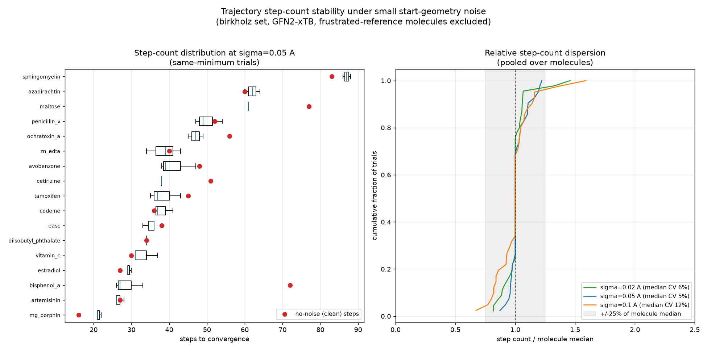
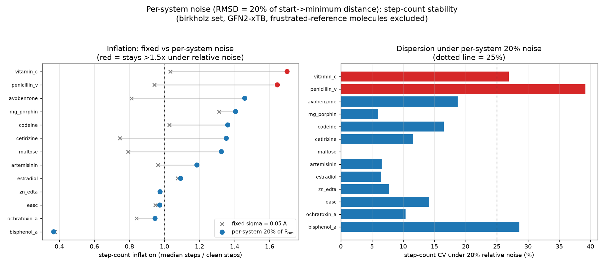

# Birkholz benchmark: convergence, minimum, and step-count stability under start-geometry noise

*Investigation, 2026-06-23. GFN2-xTB via `tblite`. Companion to the Baker
noise-stability reports
([`2026-06-20-baker-noise-stability`](../2026-06-20-baker-noise-stability),
[`2026-06-22-baker-step-count-stability`](../2026-06-22-baker-step-count-stability)),
repeating that study for the **birkholz** benchmark per
[pyberny#170](https://github.com/jhrmnn/pyberny/issues/170). See `scripts/` for
the (benchmark-generalized) analysis code, `data/` for raw outputs, and the
`*.png` figures.*

The birkholz set is the 19-molecule Birkholz–Schlegel (2016) collection of
medium, drug-like molecules (20–95 atoms: vitamin C, codeine, estradiol,
cetirizine, raffinose, azadirachtin, …). Unlike the Baker references — which are
**pre-relaxed**, so the clean optimization is unusually short (3–7 steps) — the
birkholz starts are realistic and travel a substantial distance to their minimum
(clean optimizations take **22–90 steps**, start→minimum RMSD ≈ 0.6–2.4 Å). That
difference turns out to drive most of the contrast with Baker below.

## Scope

Two studies, mirroring the Baker pair:

1. **Convergence + minimum stability** — isotropic Gaussian Cartesian noise at
   σ ∈ {0.02, 0.05, 0.1, 0.2, 0.3} Å, 3 seeds each (285 noisy trials + 19 clean).
   Raw: `data/birkholz_noise_stability.{json,md}`.
2. **Step-count stability** for same-minimum trials — fixed-σ
   (`data/birkholz_step_stability.json`, derived from the study-1 trials) and
   **per-system** noise scaled so the perturbation RMSD is 20 % of each
   molecule's start→minimum distance R$_{sm}$
   (`data/birkholz_rel_step_stability.json`, 15 molecules, the 4 largest/slowest
   excluded). Figures `birkholz_step_count_stability.png`,
   `birkholz_relative_noise_step_stability.png`.

> Three σ=0.3 trials on the two largest molecules (raffinose, sphingomyelin)
> were wall-clock-aborted (>10 min each, runaway non-convergence toward the step
> ceiling) and counted as non-converged.

## Study 1 — convergence and minimum stability

| σ (Å) | trials | converged | ceiling | error | same basin | diff basin | max \|dE\| (kcal/mol) |
|---:|---:|---:|---:|---:|---:|---:|---:|
| 0.02 | 57 | 57 | 0 | 0 | 45 | 12 | 3.5 |
| 0.05 | 57 | 57 | 0 | 0 | 42 | 15 | 2.4 |
| 0.1  | 57 | 56 | 1 | 0 | 41 | 15 | 3.8 |
| 0.2  | 57 | 45 | 5 | 7 | 32 | 13 | 6.5 |
| 0.3  | 57 | 31 | 10 | 16 | 10 | 21 | 305.4 |

**The two-regime picture holds, but breakage starts one amplitude earlier than
Baker.** Overall convergence is 86 % (vs Baker's 98 %):

- **Benign regime σ ≤ 0.1 Å:** essentially 100 % convergence (one ceiling hit at
  0.1). Costs grow but the optimizer recovers.
- **Destructive regime σ ≥ 0.2 Å:** errors and ceiling hits appear at σ = 0.2
  (12/57 fail) and dominate at σ = 0.3 (26/57 fail; max \|dE\| = 305 kcal/mol —
  broken structures). Because the molecules are larger than Baker's, the
  distorted geometries break down (`CoordinateError`, SCF non-convergence,
  step-ceiling) at **0.2 Å**, whereas Baker only broke at 0.3 Å.

### A much denser conformer landscape than Baker — and no "frustrated reference" set

The headline minimum-stability difference: **27 % of converged trials land in a
different basin** than the clean run (vs Baker's 6 %), spread across most
molecules (`inosine_cation` 14/15, `maltose` 11/15, `cetirizine` 9/15,
`raffinose`/`diisobutyl_phthalate` 7/15, …). These drug-like molecules have many
low-lying conformers, so small noise readily tips them between neighbours.

Crucially, **none of this is a Baker-style "frustrated reference."** Checking the
smallest amplitude (σ = 0.02 Å) for the methylamine signature — every seed
deterministically dropping to the *same lower* minimum — finds **no birkholz
molecule** qualifying: the different-basin trials scatter *both up and down* by
small amounts (e.g. `inosine_cation` +0.81 then −1.6 kcal/mol across σ;
`maltose` ±2–4 kcal/mol; `diisobutyl_phthalate` 2/3 seeds −0.93), which is a
dense, near-degenerate conformer manifold, not a symmetric saddle that any
perturbation resolves in one direction. So unlike Baker, **there is no fixed
exclusion set** for the step-count study — the "same minimum" energy filter
handles the basin-hopping automatically, at the cost of thinner per-molecule
statistics (many trials are discarded as different-basin).

(`minima_paths`-style interpolated basin maps were not produced for birkholz:
the basins are already characterized by the per-trial energies above, and the
larger molecules make the repeated re-optimizations prohibitively expensive in
this environment.)

## Study 2 — step-count stability

### Fixed small σ: no inflation (the Baker over-perturbation artifact is absent)

At fixed σ = 0.05 Å, conditioned on the same minimum, birkholz step counts are
**tight and essentially un-inflated**: median per-molecule CV ≈ **5 %**, median
inflation ≈ **0.97×** (i.e. ~1.0×). This is the direct converse of Baker, where
the same σ = 0.05 Å *inflated* step counts ~2× — because Baker's pre-relaxed
starts sit ~0.05 Å from their minimum, so 0.05 Å noise *over-perturbs* them and
throws away their head start. The birkholz starts travel 0.6–2.4 Å, so a 0.05 Å
kick is negligible relative to the natural path and barely changes the step
count. **The Baker "fixed-σ inflation" was an artifact of pre-relaxed starts; it
does not appear for realistic starts.**



### Per-system 20 % noise: modest inflation, well-behaved dispersion

Scaling the noise to each molecule's own travel distance (RMSD = 20 % of
R$_{sm}$, which for birkholz is a *large* 0.1–0.5 Å absolute) gives a more
informative perturbation. Step count then inflates modestly — **median ≈ 1.3×**
— with **median CV ≈ 12 %**, no ceiling tail among same-minimum trials:

| molecule | clean | R$_{sm}$ (Å) | per-system 20 % inflation | CV |
|---|---:|---:|---:|---:|
| bisphenol_a | 72 | 0.88 | 0.37× | 29 % |
| zn_edta | 40 | 0.65 | 0.97× | 8 % |
| estradiol | 27 | 0.62 | 1.09× | 6 % |
| artemisinin | 27 | 1.12 | 1.19× | 7 % |
| codeine | 36 | 0.98 | 1.36× | 17 % |
| mg_porphin | 16 | 0.63 | 1.41× | 6 % |
| avobenzone | 48 | 2.44 | 1.46× | 19 % |
| vitamin_c | 30 | 1.61 | 1.70× | 27 % |

Two notes: `bisphenol_a` *inverts* (0.37×) — its clean run is anomalously long
(72 steps), and a perturbation knocks it off that grind onto a shorter path
(the same behaviour Baker's `achtar10` showed). And there is **no π-specific
signal**: the one planar conjugated molecule here, `mg_porphin` (porphyrin),
inflates only 1.41× — birkholz simply has no pre-relaxed planar aromatics for
the soft-out-of-plane-mode mechanism to act on, so the ~2× conjugated inflation
seen for Baker's aromatics has no analogue here. Several molecules have thin
statistics (n = 1–4 same-minimum trials) because the large per-system noise
frequently changes basin in this dense conformer landscape.



## Conclusions (vs the Baker findings)

| question | Baker | birkholz |
|---|---|---|
| convergence robust at σ ≤ 0.1 Å? | yes (100 %) | yes (~100 %); breakage onsets at **0.2 Å** (vs Baker 0.3), molecules being larger |
| two-regime (benign ≤0.1, break at large σ)? | yes | yes |
| "frustrated reference" set? | yes (methylamine…) | **none** — dense low-lying conformers instead (27 % different-basin, both directions) |
| fixed-σ step inflation? | ~2× (over-perturbed pre-relaxed starts) | **~1.0×** — the artifact is absent for realistic far-from-min starts |
| per-system 20 % step inflation? | ~1.6× mean (planar-π ~2.2×) | **~1.3× median**, no π signal; CV ~12 %, bounded |

The headline: the **two-regime convergence picture generalizes**, but the
step-count story is *cleaner* for birkholz than for Baker. The dramatic fixed-σ
inflation and the planar-conjugated soft-mode inflation that complicated the
Baker step-count report were both **consequences of Baker's pre-relaxed,
near-planar references**; on realistic drug-like starts they largely disappear,
leaving a tight (~1.0× fixed, ~1.3× per-system) and well-dispersed (CV
~5–12 %) step count. The new birkholz-specific feature is a **dense conformer
landscape** (27 % basin-hopping) rather than any optimizer instability.

## Reproduce

```sh
# Study 1 (resumable trial-level driver; ~core-hours, large molecules dominate)
python scripts/sweep.py --benchmark birkholz --seeds 3 \
    --sigmas 0.02 0.05 0.1 0.2 0.3 --workers 4 --ckpt-dir ckpt \
    --out birkholz_noise_stability.md --out-json birkholz_noise_stability.json

# Study 2 — per-system noise (15 molecules, 4 largest excluded; per-(mol,frac) ckpts)
python scripts/rel_step_stability.py --benchmark birkholz --molecules <set> \
    --fracs 0.1 0.2 0.4 --nseed 6 --ckpt-dir relck
python scripts/plot_step_stability.py birkholz_step_stability.json out1.png 0.05
python scripts/plot_rel_step_stability.py birkholz_rel_step_stability.json \
    birkholz_step_stability.json out2.png 0.05
```

The fixed-σ `birkholz_step_stability.json` is derived from the study-1 trials
(same-minimum converged step counts at σ = 0.02/0.05/0.1). `sweep.py` is the
resumable trial-level driver used to run study 1 under bounded job windows /
container restarts.
