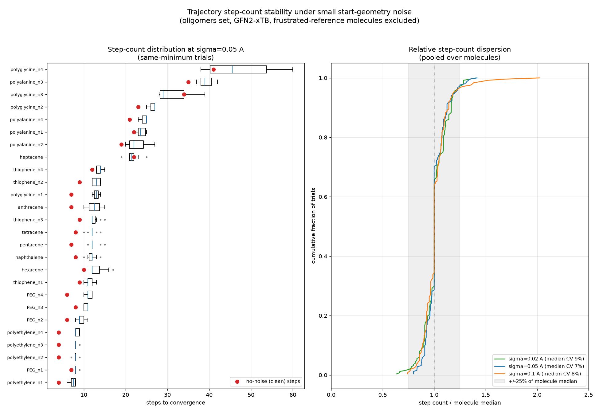
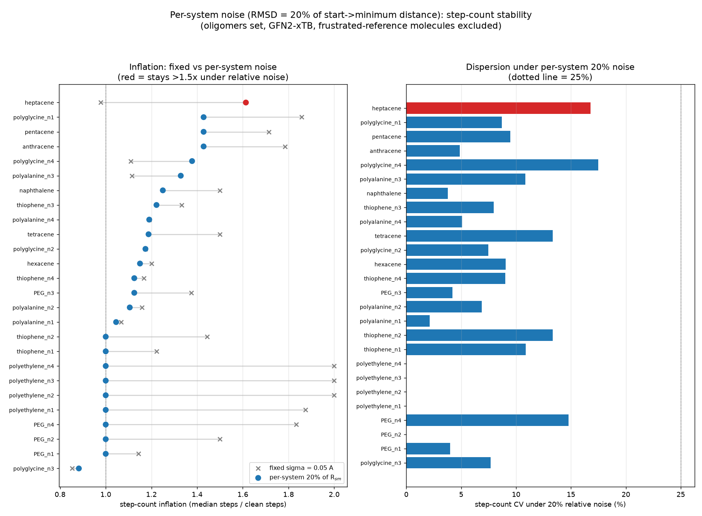

# Oligomer benchmarks: convergence, minimum, and step-count stability under start-geometry noise

*Investigation, 2026-06-23. GFN2-xTB via `tblite`. Companion to the Baker
noise-stability reports
([`2026-06-20-baker-noise-stability`](../2026-06-20-baker-noise-stability),
[`2026-06-22-baker-step-count-stability`](../2026-06-22-baker-step-count-stability)),
repeating that study for the **oligomers** benchmark per
[pyberny#170](https://github.com/jhrmnn/pyberny/issues/170). See `scripts/` for
the (benchmark-generalized) analysis code, `data/` for raw outputs, and the
`*.png` figures.*

The oligomers set is a length series of common polymers/oligomers (acenes,
poly-ynes, PPE, thiophenes, PEG, polyethylene, peptides). It is the most direct
test of the **planar-conjugated soft-mode step inflation** that survived
per-system normalization for Baker's small aromatics (benzene/naphthalene ≈2.2×):
the acene and PPE length series are exactly such π systems, so we can see whether
the inflation grows, saturates, or shrinks with chain length.

## Scope

A 43-molecule subset capped at ≤62 atoms (xTB cost) was studied, spanning the
scientifically interesting families:

- **acenes** naphthalene → nonacene (18–60 atoms) — rigid planar π;
- **PPE** poly(phenylene-ethynylene) n1–n5 (14–62) — π with linear alkyne linkers;
- **poly-ynes** diacetylene + n3–n8 (6–18) — fully linear chains;
- **peptides** polyalanine/polyglycine n1–n6 (19–54) — flexible;
- **controls** polyethylene, PEG, thiophene n1–n4 — sp³ aliphatic / non-acene.

Two studies, mirroring the Baker pair:

1. **Convergence + minimum stability** — isotropic Gaussian Cartesian noise at
   σ ∈ {0.02, 0.05, 0.1, 0.2, 0.3} Å, 3 seeds each (645 noisy trials + 43 clean).
   Raw: `data/oligomers_noise_stability.{json,md}`.
2. **Step-count stability** for same-minimum trials — fixed-σ
   (`data/oligomers_step_stability.json`) and **per-system** noise scaled so the
   perturbation RMSD is 20 % of each molecule's start→minimum distance R$_{sm}$
   (`data/oligomers_rel_step_stability.json`), on the converging subset (acenes
   + peptides + aliphatic controls; PPE excluded, see below). Figures
   `oligomers_step_count_stability.png`,
   `oligomers_relative_noise_step_stability.png`.

> Two largest acenes (octacene, nonacene) are reported with reduced seed counts
> in study 2 and omitted from the per-system plot: under noise their soft
> out-of-plane modes drive the optimization toward the 150-step ceiling, so a
> *single* trial can exceed ten minutes — itself the extreme endpoint of the
> inflation trend (below). Three σ=0.3 trials on the largest peptide were
> wall-clock-aborted and counted as non-converged.

## Study 1 — convergence and minimum stability

| σ (Å) | trials | converged | ceiling | error | same basin | diff basin | max \|dE\| (kcal/mol) |
|---:|---:|---:|---:|---:|---:|---:|---:|
| 0.02 | 129 | 118 | 1 | 10 | 115 | 3 | 0.18 |
| 0.05 | 129 | 117 | 2 | 10 | 114 | 3 | 0.18 |
| 0.1  | 129 | 118 | 3 |  8 | 110 | 8 | 0.18 |
| 0.2  | 129 | 113 | 3 | 13 | 104 | 9 | 98.7 |
| 0.3  | 129 |  88 | 9 | 32 | 67 | 21 | 142.5 |

**The two-regime picture holds, but the failure mode is errors, not breakage.**
Overall 86 % of noisy trials converge — close to Baker's number — but the
character is different:

- **A benign low-amplitude regime (σ ≤ 0.1 Å)** where the surviving molecules
  return to the same minimum (max \|dE\| 0.18 kcal/mol — *no* intermediate
  conformer band for the rigid families).
- **A destructive high-amplitude regime (σ ≥ 0.2 Å)** where rigid acenes jump to
  broken high-energy structures (different-basin dE = +24…+143 kcal/mol, always
  *up* — see below) and flexible peptides hit the step ceiling.

The most prominent feature is a **persistent error floor of ~8 % even at σ =
0.02 Å**, which Baker did not have (Baker: 0 errors below σ = 0.2). It is almost
entirely one family:

### PPE fails to build internal coordinates under *any* noise

| molecule | atoms | converged / 15 | errored / 15 |
|---|---:|---:|---:|
| PPE_n1 | 14 | 15 | 0 |
| PPE_n2 | 26 | 9 | 6 |
| PPE_n3 | 38 | 1 | 14 |
| PPE_n4 | 50 | 2 | 13 |
| PPE_n5 | 62 | 0 | 15 |

The poly(phenylene-ethynylene) backbone alternates phenyl rings with **linear
ethynylene (–C≡C–) linkers**. The clean reference optimizes fine (7–10 steps),
but *any* perturbation makes the redundant-internal-coordinate builder fail with

> `CoordinateError: Cannot build dihedrals through a near-linear chain with a
> branching terminus … This typically arises in fully linear-rich systems such
> as long poly(phenylene-ethynylene) chains.`

The failure rate climbs with the number of linkers (n1 fine → n5 never), so PPE
is effectively un-optimizable from a noisy start and is **excluded from the
step-count study**. (Pure-carbon poly-ynes, also linear, mostly survive — they
have no branching aromatic termini — with only occasional ceiling hits at n7/n8.)
Long peptides also throw the same `CoordinateError` once a noisy backbone
straightens a fragment to near-linear.

### Acenes: rigid, clean, but break "up" at high amplitude

Every acene converges at low σ and returns to the same minimum; the only
different-basin outcomes are at high σ and are **broken, higher-energy**
structures (naphthalene +84, anthracene +136, tetracene +143, pentacene
+24/+88, hexacene +79, …, nonacene up to +138 kcal/mol). Like Baker's aromatics,
they have **no low-lying conformer band** — they either return to the planar
minimum or shatter.

### Is there a "frustrated reference" set?

**No.** Unlike Baker (methylamine et al. deterministically dropping to a *lower*
minimum from the smallest noise), no oligomer relaxes to a consistently lower
basin under tiny noise. The peptides do populate **many low-lying conformers**
(e.g. polyglycine_n1: 14/15 noisy trials land in a different but near-degenerate
basin, \|dE\| ≤ 0.18 kcal/mol), confirming the expected flexible-conformer
behaviour, but these scatter both up and down by tiny amounts — they are a dense
conformer landscape, not a frustrated saddle. The step-count study's
same-minimum filter handles this automatically; no special exclusion list is
needed (only PPE is dropped, for non-convergence).

## Study 2 — step-count stability and the π soft-mode question

For trials that converge to the same minimum, the step count is **tight**:
median per-molecule CV ≈ 8–13 % at fixed σ, ≈ 9 % under per-system 20 % noise —
the same well-behaved dispersion Baker showed. The interesting axis is the
**inflation** (median noisy steps / clean steps), and how it behaves for the π
systems.

### The planar-conjugated soft-mode inflation reappears — but is modest and does not grow with length

Acene series (R$_{sm}$ = start→minimum RMSD; inflation at fixed σ = 0.05 Å vs
per-system 20 % of R$_{sm}$):

| acene | atoms | clean steps | R$_{sm}$ (Å) | infl. fixed σ=0.05 | infl. per-system 20 % | CV (per-sys) |
|---|---:|---:|---:|---:|---:|---:|
| naphthalene | 18 | 8 | 0.017 | 1.50× | 1.25× | 4 % |
| anthracene  | 24 | 7 | 0.018 | 1.79× | 1.43× | 5 % |
| tetracene   | 30 | 8 | 0.020 | 1.50× | 1.19× | 13 % |
| pentacene   | 36 | 7 | 0.022 | 1.71× | 1.43× | 9 % |
| hexacene    | 42 | 10 | 0.119 | 1.20× | 1.15× | 9 % |
| heptacene   | 50 | 22 | 1.757 | 0.98× | 1.61× | 17 % |

Three things stand out:

1. **The mechanism is real and reproduces Baker qualitatively.** The aliphatic
   controls collapse to ≈1.00× under per-system noise (polyethylene 1.00×, PEG
   1.00×, thiophene_n2 1.00×), exactly as Baker's non-conjugated molecules did,
   while the planar acenes **retain a residual ~1.2–1.4× inflation** that does
   not vanish when the noise is scaled to the (tiny) travel distance. A random
   kick still has to damp the soft out-of-plane modes of the planar skeleton.

2. **But it is much weaker than Baker (~1.3× vs ~2.2–2.5×).** Baker's
   benzene/naphthalene inflated ~2.2× because their reference starts were
   *extremely* pre-relaxed (clean ≈3–4 steps), so any displacement threw away an
   unusually large head start. The oligomer acene starts are less aggressively
   pre-relaxed (clean ≈7–10 steps), so the same soft-mode cost is a smaller
   multiple.

3. **It does not grow with conjugation length.** Across naphthalene → hexacene
   the per-system inflation is flat at ~1.2–1.4× — longer acenes do **not**
   inflate more once the noise tracks their own travel distance. (heptacene's
   1.61× / R$_{sm}$ = 1.76 Å is an artefact of a poorly pre-relaxed bundled
   start, not the soft-mode trend.)

The extreme end of the trend is qualitative: **octacene and nonacene become so
soft that per-system noise drives them toward the 150-step ceiling** (single
trials > 500 s), so the "inflation" there is better described as
runaway-toward-ceiling than a tight multiplier. The very long acenes are the one
place the soft-mode cost genuinely blows up — but as non-convergence, not as a
bounded inflation.

PPE — the other π family that should test this most directly — **could not be
measured**: it errors out under any noise (above), so there is no soft-mode
inflation to report, only a coordinate-builder robustness failure.

### Peptides

Flexible polyalanine/polyglycine inflate modestly (1.0–1.4× per-system) with
moderate dispersion (CV up to ~17 %), consistent with many shallow conformers
but no blow-up; the longer ones increasingly hit the ceiling or the near-linear
`CoordinateError` at high amplitude rather than scattering in step count.





## Conclusions (vs the Baker findings)

| question | Baker | oligomers |
|---|---|---|
| convergence robust at σ ≤ 0.1 Å? | yes (100 %) | mostly — but a ~8 % **PPE/linear `CoordinateError` floor** at all σ |
| two-regime (benign ≤0.1, break at large σ)? | yes | yes; high-σ breakage is "up" (broken aromatics) + peptide ceiling |
| "frustrated reference" set? | yes (methylamine…) | **none**; peptides show dense low-lying conformers instead |
| planar-π soft-mode inflation survives per-system normalization? | yes, ~2.2× | yes for acenes but **weaker (~1.3×)** and **length-independent** |
| does the inflation grow with π length? | n/a | **no** — flat for naphthalene→hexacene; only the longest acenes blow up (to the ceiling, not a bounded multiplier) |

The headline: the Baker mechanisms **generalize in kind but not in magnitude**.
The conjugated soft-mode inflation is reproduced (acenes keep a residual
inflation that aliphatics do not) but is smaller and does not amplify with chain
length; the dominant new phenomenon is a **coordinate-builder robustness limit
for linear-rich systems** (PPE, long peptides), which is a more practically
relevant failure than the step-count inflation.

## Reproduce

```sh
git submodule update --init external/oligomer-benchmarks   # geometries
SEL="naphthalene anthracene … thiophene_n4"                # 43-molecule subset

# Study 1 (resumable, ~several core-hours; checkpoints per trial)
python scripts/sweep.py --benchmark oligomers --molecules $SEL \
    --seeds 3 --sigmas 0.02 0.05 0.1 0.2 0.3 --workers 4 --ckpt-dir ckpt \
    --out oligomers_noise_stability.md --out-json oligomers_noise_stability.json

# Study 2 (converging subset; per-(molecule,frac) and per-molecule checkpoints)
python scripts/rel_step_stability.py --benchmark oligomers --molecules <set> \
    --fracs 0.1 0.2 0.4 --nseed 12 --ckpt-dir relck
python scripts/step_stability.py --benchmark oligomers --molecules <set> \
    --sigmas 0.02 0.05 0.1 --nseed 10 --ckpt-dir fixck
python scripts/plot_step_stability.py oligomers_step_stability.json out1.png 0.05
python scripts/plot_rel_step_stability.py oligomers_rel_step_stability.json \
    oligomers_step_stability.json out2.png 0.05
```

`sweep.py` is the resumable trial-level driver (survives the bounded job windows
and container restarts this study was run under); the step scripts take
`--benchmark` / `--exclude` and per-molecule (`step_stability`) or
per-`(molecule,frac)` (`rel_step_stability`) checkpoints. Requires pyberny from
a checkout with the oligomer submodule initialised.
