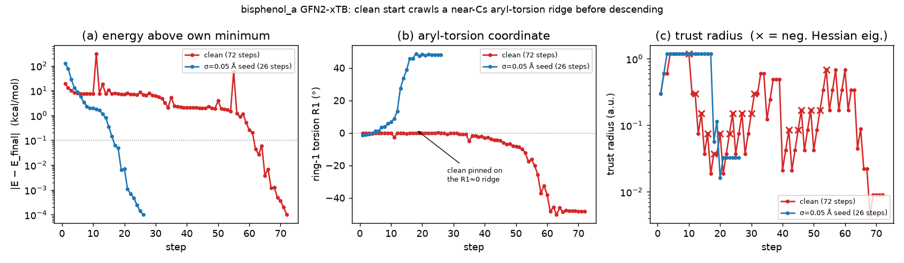

# bisphenol_a: the slow clean GFN2-xTB run is a near-symmetric (Cs) start-geometry artifact

*Investigation, 2026-06-25. GFN2-xTB via `tblite`. Follow-up to
[pyberny#171](https://github.com/jhrmnn/pyberny/issues/171), which flagged
`bisphenol_a` as the one birkholz molecule where start-geometry noise makes the
optimization **faster** (roughly halving the step count) instead of slower. See
`scripts/` for the analysis code, `data/` for raw traces, and
`bisphenol_a_ridge.png` for the figure.*

## TL;DR

The bundled `bisphenol_a` start geometry is **near-Cs-symmetric**: its whole
heavy-atom framework (plus the perpendicular second ring) maps onto its mirror
image to within ~0.02 Å, and the two aryl–C(CH₃)₂ torsions sit *exactly* on a
symmetry element — ring 1 in the mirror plane (R₁ = 0.0°), ring 2 perpendicular
to it (R₂ = 90.0°). A gradient optimizer seeded on that plane has almost no
force along the symmetry-breaking torsional mode, so it **crawls along the ridge
for ~50 steps** — Hessian indefinite, RFO repeatedly taking saddle-avoiding
on-sphere steps, trust radius collapsing and recovering — until accumulated
numerical asymmetry finally tips it off, after which it descends in ~20 steps.
The 72-step clean count is dominated by *when* the run leaves the ridge, not by
real optimization work.

This is the birkholz analogue of the symmetric-saddle problem behind
[#148](https://github.com/jhrmnn/pyberny/issues/148), except the start is only
*approximately* symmetric (one para-OH hydrogen breaks the exact point group),
so it is a **soft near-symmetric ridge** rather than an exact symmetry element.
Any tiny symmetry-breaking nudge — random noise ≥ ~0.002 Å, or a deterministic
≥ ~1° ring twist — removes the ridge crawl and the count drops to ~25–40.

**The xTB benchmark reference already records `xtb_gfn2_steps: null` for
bisphenol_a, and this investigation confirms that is the right call.** The
slowness is a property of the symmetric *start*, not of the optimizer's
performance on this molecule, and the step count is intrinsically
noise-dominated (single-thread 72, but multi-thread scatters 63–85). No
reference value should be graded against it.

## Reproducing the clean run

Single-threaded (`OMP_NUM_THREADS=1`), the clean optimization is bitwise-stable
at **72 steps** (E = −48.408224 Ha), exactly as reported. With default
multi-threaded `tblite` it scatters — 72 / 77 / 80 over three runs here — because
`tblite`'s non-deterministic OpenMP reductions change *when* the run tips off the
ridge. That is the same ~1e-9 Ha noise the birkholz `SOURCE.md` already cites for
the 63–85 spread that got bisphenol_a's xTB count nulled.

## Root cause: the start sits on a Cs mirror plane

Reflecting the start through the plane *z* ≈ 0.021 Å (the mean plane of ring 1 +
the central carbon) maps **every atom onto an atom of the same element within
≤ 0.023 Å — except a single one**: the ring-1 para-OH hydrogen (H32), which is
rotated 1.5 Å out of the plane. So the framework — the central C, both rings,
the two methyls (which swap), and both para-oxygens — is Cs to ~0.02 Å; only one
OH hydrogen spoils the exact point group.

In the torsional subspace that matters, the start is *exactly* symmetric:

| coordinate | start | meaning |
|---|---:|---|
| R₁ = dihedral(Cₒ₁–Cᵢ₁–C_central–Cᵢ₂) | **0.0°** | ring 1 lies in the mirror plane |
| R₂ = dihedral(Cₒ₂–Cᵢ₂–C_central–Cᵢ₁) | **90.0°** | ring 2 is perpendicular, bisected by it |

Descending to a minimum *requires breaking that mirror* (the clean minimum has
R₁ = −48°, R₂ = 134°), and a gradient method cannot do that quickly from exactly
on the plane.

## Anatomy of the 72 steps



The trace (`data/clean.trace.json`) shows three distinct phases:

- **Steps 1–~10 — quick approach.** Energy falls to ~7 kcal/mol above the
  eventual minimum; gradient RMS drops to ~1e-4. The molecule relaxes
  everything *except* the frozen ring torsions.
- **Steps ~10–~55 — the ridge crawl.** R₁ stays pinned within ~0.4° of zero
  (panel b, red): the two aryl torsions barely move for ~40 steps. Over this
  stretch the Hessian is indefinite — **17 of 72 steps carry a negative
  eigenvalue** (down to −28), **52 steps are RFO "on-sphere" steps**, and the
  **trust radius collapses below 0.05 a.u. 22 times** (panel c, red, with ×
  marking negative-eigenvalue steps). Energy thrashes between ~6 and ~11
  kcal/mol with no net progress. The molecule does not get stably within 1
  kcal/mol of its own minimum until **step ~58**.
- **Steps ~55–72 — the descent.** Once R₁ finally breaks away from zero
  (≈ step 40 onward, reaching −48° by step 70) the molecule rolls smoothly into
  the minimum and converges.

A perturbed start (panel, blue: σ = 0.05 Å, 26 steps) skips the entire middle
phase — it begins slightly off the plane, so R₁/R₂ roll monotonically into a
minimum with **zero** negative-eigenvalue steps and no trust collapse.

## The clean and perturbed runs land in *different*, near-degenerate conformers

This is not merely "same minimum, fewer steps." The clean descent and the noisy
descents reach **different propeller conformers** that happen to be nearly
degenerate:

| run | steps | R₁ | R₂ | E − E_clean | RMSD vs clean |
|---|---:|---:|---:|---:|---:|
| clean | 72 | −48° | 134° | 0.00 kcal/mol | 0.00 Å |
| σ = 0.05 Å noise | 26 | +48° | +48° | +0.00–0.09 kcal/mol | 1.66 Å |

Both are genuine minima (positive-definite Hessian at convergence) separated by
~1.6 Å RMSD but only ~0.0–0.1 kcal/mol in energy. So the noise-stability study's
"same basin" verdict (|ΔE| ≤ 0.1 kcal/mol) is a *near-degeneracy coincidence*,
not literal return to the same point — consistent with the dense low-lying
conformer manifold the companion birkholz report already described. A directed
twist that breaks symmetry *toward* the clean side reaches the −48°/134°
minimum in 26 steps, confirming that the deep minimum itself is cheap to reach;
the 72 steps are spent on the ridge, not on getting to that particular
conformer.

## Candidate fixes (issue's "different Hessian / deterministic break?")

**A directed symmetry break works and is cheap.** Twisting ring 2 by a fixed
angle about its bond to the central carbon (deterministic, no randomness)
collapses the count, and even sub-degree twists help:

| twist | 20° | 10° | 5° | 2° | 1° | 0.5° | 0.2° | 0.1° | 0.05° |
|---|---:|---:|---:|---:|---:|---:|---:|---:|---:|
| steps | 24 | 26 | 25 | 33 | 34 | 32 | 38 | 40 | 48 |

**Tiny isotropic noise works too, down to a very small amplitude.** The speedup
onsets well below the σ = 0.02 Å tested in #171:

| σ (Å) | 0.001 | 0.002 | 0.005 | 0.01 | 0.02 |
|---|---|---|---|---|---|
| steps (3 seeds) | 41, 49, 99 | 42, 41, 39 | 40, 32, 57 | 43, 53, 41 | 38, 28, 33 |

σ = 0.002 Å (≈ 0.0035 Å RMSD) already halves it reliably; σ = 0.001 is marginal
(one seed nearly hit the ceiling).

**The trust radius is *not* a clean fix — its effect is erratic and partly
spurious.** Sweeping the initial trust radius on the unperturbed start:

| trust | 0.10 | 0.15 | 0.20 | 0.30 (default) | 0.50 | 0.80 | 1.50 |
|---|---:|---:|---:|---:|---:|---:|---:|
| steps | 52 | 54 | **23** | 72 | 57 | 72 | 72 |
| minimum | propeller | −48/134 | **R₁≈0, +2.07 kcal/mol** | −48/134 | −48/134 | −48/134 | −48/134 |

The apparently great `trust = 0.20` (23 steps) is a **false win**: it converges
to an inferior, *still-near-symmetric* minimum (R₁ ≈ 0°, R₂ ≈ 89°) that is
2.07 kcal/mol higher — it quits on the ridge rather than escaping it. The
chaotic, non-monotonic step counts under trust changes are themselves a symptom
of the knife-edge ridge, not a tuning knob to exploit.

## Relation to `symmetry='break'` (#148)

This is exactly the mechanism `Berny(..., symmetry='break')` exists to cure: a
symmetric start on which a gradient optimizer stalls. The catch is that
bisphenol_a is only *approximately* Cs — the out-of-plane para-OH hydrogen makes
the true point group C1, and the framework symmetry is ~0.02 Å, not exact. So
whether pyberny's exact point-group detector (`detect_point_group`, via
`molsym`) flags this start, and thus whether `symmetry='break'` would fire on it
unprompted, is uncertain and was **not** verifiable in this environment (the
`molsym` git dependency is unreachable behind the sandbox proxy). What is
certain: the start lives on a soft near-symmetric ridge, and *any* small
symmetry-breaking displacement — including the kind `symmetry='break'` applies —
removes the slowdown. If the detector does treat near-symmetric (few-hundredths-
of-an-Å) frameworks as symmetric, `symmetry='break'` is the principled fix; if
it requires exact symmetry, this case sits just outside its reach and is worth
noting as a near-symmetric blind spot.

## Recommendation on the benchmark reference

No change to the benchmark is warranted, and specifically:

1. **Keep `xtb_gfn2_steps: null` for bisphenol_a.** The existing null (and the
   `SOURCE.md` rationale) are correct. This work pins down *why*: the count is
   set by when numerical noise tips the run off a near-Cs ridge, so it is
   intrinsically irreproducible (single-thread 72, multi-thread 63–85) and is
   not a meaningful measure of optimizer performance to gate against.
2. **Do not alter the bundled start geometry.** It is the canonical published
   Birkholz–Schlegel coordinate set; de-symmetrizing it would break provenance
   for a cosmetic step-count gain. The right place for any fix is the optimizer
   option (`symmetry='break'`), invoked by the user, not the reference data.
3. The PySCF `pyberny_steps: 50` (HF/3-21G) for bisphenol_a — flagged in #171 as
   "high for its size" — most likely reflects the *same* ridge crawl on the same
   start geometry. That run is deterministic (HF has no `tblite`-style reduction
   noise), so it yields a fixed but plausibly inflated 50; this was not
   re-measured here (no PySCF in this environment). It is a documented baseline,
   not a target the optimizer is being asked to beat, so it needs no change —
   but it is worth remembering that this molecule's references are
   symmetric-start-inflated under both QM methods.

## Reproduce

```sh
# needs: pip install -e ".[benchmark]"   (tblite); OMP_NUM_THREADS=1 for the 72
python scripts/trajectory.py   out          # clean + noisy runs, traces + paths
python scripts/experiments.py  out          # Cs test, twist/trust/noise fixes
python scripts/make_figure.py  out bisphenol_a_ridge.png
```

`data/clean.trace.json` is the full structured trace of the clean 72-step run;
`data/run_summary.json` and `data/experiments.json` hold the step counts /
energies behind the tables above.
