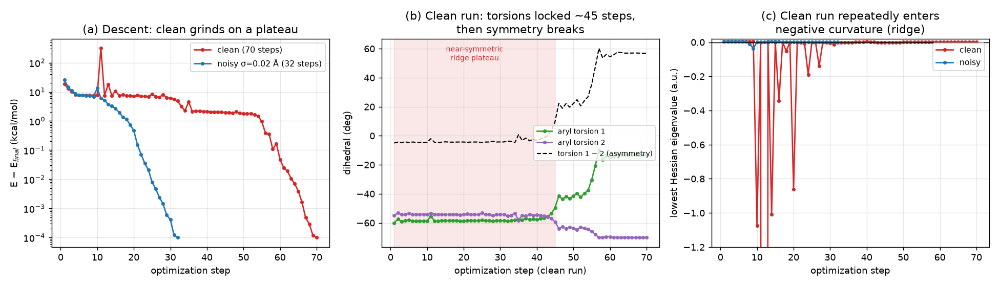

# bisphenol_a: why the clean GFN2-xTB optimization is slow (and noise speeds it up)

*Investigation, 2026-06-25. GFN2-xTB via `tblite`; confirmation runs in
HF/3-21G via PySCF. Follow-up to [pyberny#171](https://github.com/jhrmnn/pyberny/issues/171),
which spun out of the birkholz start-geometry noise study
([`2026-06-22-birkholz-noise-stability`](../2026-06-22-birkholz-noise-stability),
[#170](https://github.com/jhrmnn/pyberny/issues/170)). See `scripts/` for the
analysis code, `data/` for the raw optimizer traces, and
`bisphenol_a_ridge.png` for the figure.*

## The anomaly

In the birkholz noise study, **`bisphenol_a` was the only molecule where
adding start-geometry noise made the optimization converge *faster*** —
roughly halving the GFN2-xTB step count while landing in the same minimum
(per-system 20 % noise inflated it by 0.37×, i.e. noise *helps*). Its clean
run is anomalously long for a 33-atom molecule.

This report confirms and explains that. The short version: bisphenol_a is two
phenol rings bridged by a `C(CH3)2` quaternary carbon, and the bundled start
geometry is **near-C2-symmetric**. The descent to the (asymmetric) minimum has
to break that near-symmetry by rotating the two aryl–C(CH3)2 torsions away from
each other. Started exactly on the near-symmetric ridge, the optimizer spends
dozens of steps unable to pick a direction — the Hessian goes indefinite and
the trust region thrashes — before it finally rolls off. A tiny perturbation
pre-breaks the symmetry and the grind disappears. **This is not a pyberny bug:
Birkholz & Schlegel flagged bisphenol_a as exactly this kind of
negative-eigenvalue / soft-torsion hard case in the original benchmark paper**
(see "Connection to the paper" below).

## Reproducing the clean slowness — and its irreproducibility

Eight clean GFN2-xTB runs from the bundled start scatter widely in step count
while all reaching the **same** minimum (energy spread 2×10⁻⁴ kcal/mol):

| run | 1 | 2 | 3 | 4 | 5 | 6 | 7 | 8 |
|---|---:|---:|---:|---:|---:|---:|---:|---:|
| clean steps | 78 | 81 | 77 | 77 | 62 | 94 | 62 | 70 |

Median ≈ 77, range 62–94. This matches the issue's clean run (72 steps) and the
benchmark's own note that bisphenol_a "ranged 63–85 over four runs"
(`birkholz_schlegel/SOURCE.md`). The scatter is itself a *symptom*: near a flat
ridge, `tblite`'s non-bitwise-deterministic OpenMP reductions (~10⁻⁹ Ha) are
enough to reroute the trust-radius path — which is exactly why
`xtb_gfn2_steps` is already left `null` for this molecule in the benchmark.

Small start perturbations cut the count roughly in half, conditioned on the
same minimum (max |ΔE| = 0.09 kcal/mol across all kept trials):

| noise | step counts (same-minimum trials) | median |
|---|---|---:|
| clean (σ = 0) | 62–94 (above) | ~77 |
| σ = 0.02 Å | 38, 35, 47, 29, 31, 31 | 33 |
| σ = 0.05 Å | 38, 31, 34, 52, 34, 29 | 34 |
| σ = 0.1 Å  | 26, 41, 24, 27, 40, 28 | 27.5 |

Even the smallest perturbation tested halves the step count and it stays low
across amplitudes — consistent with the issue's table. It is not basin-hopping
(always the same minimum); the clean trajectory itself is the slow one.

## Where the clean steps go: a near-symmetric torsional ridge

Tracing a representative clean run (70 steps) against a noisy one (σ = 0.02 Å,
32 steps) with pyberny's built-in `trace=` facility pins down the mechanism.
All three panels below describe this same matched pair.



**(a) The descent stalls on a plateau.** The clean run drops to ~7 kcal/mol
above the minimum within ~10 steps and then *grinds there for ~35 steps*,
making little net progress, before escaping and converging. The noisy run never
plateaus.

**(b) The two aryl torsions stay locked, then the symmetry breaks.** The bundled
start has the two methyl–Cq–Cipso–Cortho dihedrals nearly equal (−60° and −55°,
difference ≤ 5°) — the near-C2 geometry. Through ~step 45 of the clean run the
two torsions stay locked together (asymmetry |Δ| ≤ 5°): the optimizer cannot
decide *which* ring to rotate. Only after the plateau does the near-symmetry
break, the torsions split, and the run rolls down to the **asymmetric** minimum
(−13°, −70°; Δ ≈ +57°). The noisy run reaches the identical minimum (−13°, −70°)
in a third of the steps.

**(c) The clean run repeatedly enters negative curvature.** While stuck on the
ridge, the lowest Hessian eigenvalue keeps going negative (down to ≈ −28 a.u. on
one catastrophic step), so the quadratic model has a downhill direction the
trust region won't let it take far. The optimizer takes **49 of 70 steps on the
trust-sphere**, **11 steps with a negative Hessian eigenvalue**, and **10 steps
that go uphill** (the last at step 48) — repeatedly overshooting the ridge and
recovering, with the trust radius collapsing as low as 0.019 a.u. The noisy run
has **1** uphill step and **2** negative-eigenvalue steps, and descends almost
monotonically.

In short, the clean run wastes roughly half its steps oscillating across a soft,
near-symmetric torsional ridge it was seeded directly on top of; the
perturbation drops it onto one side of the ridge, where the curvature is
positive and the descent is short and smooth.

## Is the *graded* step count inflated? Mostly an xTB effect

The benchmark grades two counts for bisphenol_a. `xtb_gfn2_steps` is already
`null`. The graded `pyberny_steps: 50` is an **HF/3-21G** run (the paper's
method/basis), so the natural question is whether the same ridge inflates *it*.

Running the benchmark's exact HF/3-21G path
(`pyscf.geomopt.berny_solver`) clean vs perturbed:

| HF/3-21G | clean | σ = 0.02 (seed 1) | σ = 0.02 (seed 2) |
|---|---:|---:|---:|
| steps | 49 | 47 | 40 |

(All converge to the same minimum, ΔE = −0.04 kcal/mol. A third seed did not
finish before a container restart; `data/hf_results.json` notes this.)

The clean HF run reproduces the committed `pyberny_steps: 50`, and perturbation
only nudges it (49 → 40–47, ≈ 0.9×) — **nothing like the ~2× drop seen for
xTB**. The clean HF trace shows the *same kind* of pathology (3 negative-
eigenvalue steps, 3 uphill steps, on-sphere grinding) but far milder than xTB's
11/10. So the ridge is a real feature of both surfaces, but it is **dramatically
amplified on the semi-empirical GFN2-xTB surface** and is comparatively benign
on HF/3-21G.

This is precisely what Birkholz & Schlegel anticipated:

> *"It is possible that greater differences … would be observed when the surface
> is less regular than ab initio or DFT surfaces (for example, using
> semi-empirical energies …)."*

## Connection to the paper

The slow behaviour is a documented property of this molecule, not a pyberny
artifact. In Birkholz & Schlegel's Table 1 (iterations to converge,
HF/3-21G), bisphenol_a stands out:

| method | Cartesian | QN | **Standard** | FlowPSB | FlowSSB | SRFO | RotCrd |
|---|---:|---:|---:|---:|---:|---:|---:|
| Bisphenol A | 94 | **Fail**ᶜ | **31** | 32 | 31 | **21** | 30 |

- **The quasi-Newton method *fails* on bisphenol_a**, footnote *c*: *"The updated
  Hessian had a negative eigenvalue, and so the quasi-Newton optimizer was
  terminated prior to convergence."* Only 4 of 20 molecules fail QN this way.
  That is the same negative-eigenvalue regime seen in panel (c); pyberny's
  RFO-based "Standard" method survives it (QN doesn't) but pays in oscillation.
- **bisphenol_a is one of only four molecules** (with Azadirachtin, EASC,
  Inosine) where the scaled-RFO refinement helped *most* over the Standard
  method (21 vs 31 steps, same minimum). The authors' explanation is the same
  soft-coordinate lever the noise pulls here: *"the SRFO effectively emphasizes
  changes to dihedral and valence angles early in the optimization."*
- The general mechanism is stated outright: *"the vibrational modes in a molecule
  tend to be a combination of both soft angular/torsional and stiff bond stretch
  coordinates, which can lead to oscillations and poor convergence behavior."*

The paper's "Standard" method (the algorithm pyberny implements) already needs
31 HF/3-21G steps for this 33-atom molecule — on the slow side for its size —
and pyberny's own HF run needs ~49–50; both are honest reflections of a genuinely
awkward PES, not a defect.

## Conclusions and recommendation

| question (issue #171) | finding |
|---|---|
| Repro the slow clean run? | Yes — 62–94 steps (median ~77), all same minimum; the scatter is itself a flat-ridge symptom. |
| Where are the steps spent? | Oscillating across a soft near-symmetric aryl-torsional ridge: ~35-step energy plateau, torsions locked ~45 steps, 11 negative-eigenvalue steps, 49/70 on-sphere, trust collapsing — then a clean roll-off once the near-C2 symmetry breaks. |
| Soft dihedral coordinate? | Yes — the two methyl–Cq–Cipso–Cortho torsions; start near-equal (Δ ≤ 5°), minimum asymmetric (Δ ≈ 57°). |
| Sensitive to a symmetry break? | Yes — any small perturbation (σ ≥ 0.02 Å) halves the count to the same minimum. The start is detected as `C1` (the OH hydrogens break exact symmetry), so `Berny(symmetry='break')` does not fire; the ridge is a *near*-symmetry effect. |
| Method-dependent? | Strongly. ~2× inflation on GFN2-xTB; only ~0.9× on HF/3-21G — as the paper predicted for "less regular" semi-empirical surfaces. |
| Revisit the benchmark reference? | **No change needed.** `xtb_gfn2_steps` is already `null` (irreproducible — this report explains *why*). The graded HF `pyberny_steps: 50` is **not** meaningfully ridge-inflated (perturbation barely changes it) and is a fair value; leave it. |

**Bottom line.** bisphenol_a's slow, irreproducible clean GFN2-xTB count is a
real, mechanistically understood consequence of seeding a gradient optimizer on
a near-symmetric torsional ridge with indefinite curvature — the birkholz
analogue of Baker's `achtar10`, and the very behaviour the benchmark's original
authors documented (QN failure, large SRFO gain). The benchmark already handles
it correctly by leaving the xTB count out of the regression gate; nothing in the
optimizer or the reference data needs to change on account of this molecule.

## Reproduce

```sh
cd scripts

# xTB: traced clean vs noisy pair (energy/eigenvalue/torsion data for the figure)
python trace_opt.py --out-dir ../data --sigma 0.02 --seed 12345
python analyze_trace.py ../data/xtb_trace_clean.json ../data/xtb_trace_noisy.json

# xTB: clean-vs-noise step-count scatter (8 clean runs + 6 seeds × 3 amplitudes)
python scatter.py --out-dir ../data --nclean 8 --nseed 6

# HF/3-21G confirmation (slow: ~30–40 min per optimization)
OMP_NUM_THREADS=4 python hf_ridge_test.py --out-dir ../data

# Figure
python plot.py --data ../data --out ../bisphenol_a_ridge.png
```

The committed traces in `data/` are from a single host; exact step counts are
not bitwise-reproducible across runs (that irreproducibility is part of the
finding), but the qualitative picture — long plateau, locked torsions,
negative-curvature thrashing, ~2× speed-up under noise — is robust.
