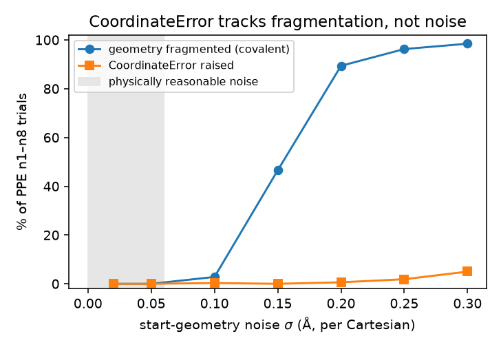

# PPE `CoordinateError` is a fragmentation artifact, not a coordinate-builder bug

*Investigation, 2026-06-26. Root-cause of the poly(phenylene-ethynylene)
internal-coordinate `CoordinateError` reported in
[pyberny#173](https://github.com/jhrmnn/pyberny/issues/173), following up on the
oligomer noise-stability study
([`2026-06-22-oligomers-noise-stability`](../2026-06-22-oligomers-noise-stability),
[#170](https://github.com/jhrmnn/pyberny/issues/170)). All numbers and the
figure are regenerated by `scripts/analyze.py`; raw output in
`data/analysis.json`.*

## TL;DR

Issue #173 reads the PPE failures as a **robustness limit of the
redundant-internal-coordinate builder on linear-rich chains** — "the builder
raises `CoordinateError` for essentially any noise, even σ = 0.02 Å, and the
failure grows with chain length." The data does not support that reading.

- The `CoordinateError` is raised **only after the perturbed geometry has broken
  into disconnected covalent fragments.** Across every reproduced failure
  (25 trials), the geometry had ≥ 2 covalent fragments; **not one** occurred on
  an intact molecule.
- That fragmentation **never happens at small noise.** At σ = 0.02 and 0.05 Å,
  PPE_n1–n8 never fragment and never raise (640 trials, 0 of each). The tightest
  covalent bond in PPE_n5 sits 0.41 Å below its break cutoff — unreachable by a
  ~0.1 Å peak displacement.
- The single σ = 0.02 `CoordinateError` in the #173 report is the lone
  coordinate error in the entire PPE series; the other ~47 PPE failures are
  `TBLiteRuntimeError: SCF not converged` (42) and `RuntimeError` (5). PPE's real
  robustness gap under noise is **SCF non-convergence**, not coordinate building.
- Noise does **not** introduce new linear angles. The offending angles are the
  alkyne backbone, already 175–180° in the relaxed structure; what noise does is
  *fragment* the molecule, after which pyberny's fragment-reconnection step lays
  down long pseudo-bonds, and one of those happens to fall collinear with a real
  bond.

**Conclusion: not a bug.** The builder is correct for every physically
meaningful input; it only mis-handles a connectivity it should never be handed —
disconnected fragments stitched together by long bridge bonds. Failing loudly in
that untested regime is the safer behavior, so no code change was made.

## How the error actually arises

`InternalCoords.__init__` builds connectivity in two steps:

1. **Covalent bonds:** `dist < 1.3·(r_i + r_j)`.
2. **Fragment reconnection** (only if step 1 leaves disconnected clusters): add
   the shortest bonds between fragments using a van-der-Waals radius sum plus a
   shift that grows by 1 Å until everything is connected.

Step 2 is the culprit. On an intact molecule it never runs. On a *fragmented*
one it inserts long "bridge" pseudo-bonds whose geometry is arbitrary — and if a
bridge lands nearly collinear with an atom's real bonds, the dihedral builder
(`get_dihedrals`) sees a chain terminus with **two** near-linear neighbours,
which its single-chain linear-extension assumption cannot represent, so it
raises.

### The canonical case, measured

The first PPE_n5 start perturbed at σ = 0.2 Å that raises (seed 94, RMSD 0.30 Å)
has **fragmented into 4 covalent pieces.** The error reports
`center=[1, 40], linear_l=[0, 2], linear_r=[0]`. Measuring that centre:

| centre "bond" | distance | covalent cutoff | covalently bonded? |
|---|--:|--:|:--:|
| C1–H40 | **2.594 Å** | 1.495 Å | **no — it is a fragment bridge** |

C1's neighbours and their angle to the C1→H40 bridge axis:

| neighbour of C1 | bond type | angle to bridge (noisy) | same angle, clean | classed |
|---|---|--:|--:|:--:|
| C0 | real C≡C | 2.55° | 0.14° | linear (≤ 5°) |
| C2 | real C–C | 175.36° | 179.52° | linear (≥ 175°) |
| H41 | bridge | 126.30° | 126.63° | normal |

Both real neighbours register as "linear" → `linear_l = [C0, C2]` → raise. Note
the angles are essentially the same as in the clean geometry (2.55° vs 0.14°,
175.36° vs 179.52°): these are the rigid alkyne, **already near-linear before any
noise.** The only thing noise changed is that the molecule came apart and the
`C1–H40` bridge was invented to glue it back.

## Failure requires fragmentation

Sweeping PPE_n1–n8 over σ ∈ {0.02 … 0.3} Å (40 seeds each, 320 trials per σ) and
recording the covalent-fragment count of every trial that raises:

| `CoordinateError` trials | by covalent-fragment-count of the perturbed geom |
|---|---|
| 25 total | 2:2, 3:1, 4:1, 5:1, 6:1, 7:3, 8:2, 9:2, 10:1, 12:3, 13:2, 14:1, 15:2, 17:1, 18:1, 20:1 |
| **on an intact (1-fragment) molecule** | **0** |

Per-amplitude rates (`fragmentation_onset.png`):

| σ (Å) | fragmented | CoordinateError |
|--:|--:|--:|
| 0.02 | 0 / 320 | 0 / 320 |
| 0.05 | 0 / 320 | 0 / 320 |
| 0.10 | 9 / 320 | 1 / 320 |
| 0.15 | 149 / 320 | 0 / 320 |
| 0.20 | 286 / 320 | 2 / 320 |
| 0.25 | 308 / 320 | 6 / 320 |
| 0.30 | 315 / 320 | 16 / 320 |



Fragmentation is *necessary but not sufficient*: even at σ = 0.2 Å, 286/320
trials fragment but only 2 raise — the bridge also has to land collinear with a
real bond, which is rare. The error rate tracks the fragmentation curve, not the
noise amplitude, and is essentially zero across the physically reasonable band
(σ ≲ 0.05–0.1 Å).

## What about the "grows with chain length" observation?

That part is real, but it follows from fragmentation, not from a chemistry-
specific coordinate failure. Two contributing facts:

- A longer chain has more bonds, so a given σ is more likely to snap at least one
  and fragment it; once fragmented, more pieces mean more bridges and more
  chances for a collinear one.
- The alkyne backbone angles do creep toward the 175° linear-detection threshold
  with length (clean geometries):

  | mol | atoms | #angles > 170° | #within 2° of 175° | min gap to 175° |
  |---|--:|--:|--:|--:|
  | PPE_n1 | 14 | 2 | 0 | 4.99° |
  | PPE_n2 | 26 | 4 | 0 | 4.95° |
  | PPE_n3 | 38 | 6 | 0 | 2.14° |
  | PPE_n4 | 50 | 8 | 2 | 0.85° |
  | PPE_n5 | 62 | 10 | 4 | 0.78° |
  | PPE_n6 | 74 | 12 | 5 | 0.73° |
  | PPE_n7 | 86 | 14 | 8 | 1.50° |
  | PPE_n8 | 98 | 16 | 8 | 1.17° |

  This makes the *post-fragmentation* dihedral construction more brittle for
  longer chains, but it is not itself a trigger: it never fires on the intact
  molecule at any length.

## Takeaways

- #173 should be closed as **not-a-bug**: the coordinate builder is correct for
  physical inputs; the `CoordinateError` is confined to the unphysical,
  fragmented regime the optimizer was never designed to accept, where a clear
  crash is preferable to silently optimizing a glued-together non-molecule.
- The genuine PPE-under-noise weakness worth tracking is **SCF non-convergence**
  (xTB) at large distortion — a solver issue, separate from internal coordinates.
- If disconnected-fragment inputs are ever to be *supported* (rather than
  rejected), the fix belongs in the fragment-reconnection heuristic (don't lay
  bridges collinear with existing bonds), not in `get_dihedrals`.

## Reproduce

```
python scripts/analyze.py    # writes data/analysis.json and fragmentation_onset.png
```

Requires a source checkout with the `external/oligomer-benchmarks` submodule
initialised (`git submodule update --init external/oligomer-benchmarks`).
