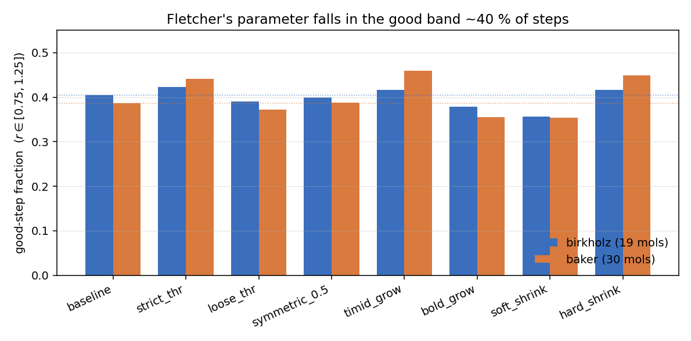
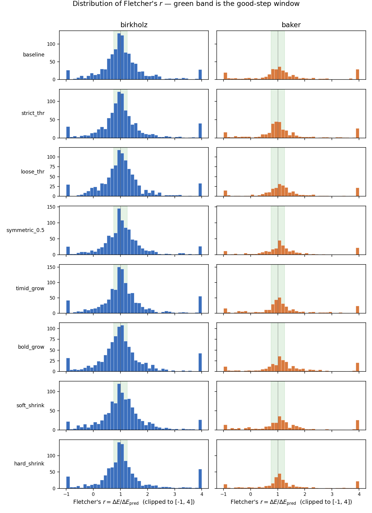

# Fletcher trust-radius parameter sweep

## TL;DR

Across the two fast CI benchmarks under MOPAC PM7 — Birkholz–Schlegel
(19 molecules, 1077 baseline steps) and Baker/Shajan (30 molecules,
365 baseline steps) — pyberny's stock Fletcher trust-radius update
lands the quadratic prediction within ±25 % of the actual energy change
on only **≈ 40 %** of steps (40.4 % Birkholz, 38.6 % Baker, band
`r ∈ [0.75, 1.25]`).

A sweep of seven one-knob variants of the rule shows the biggest gains
in "good-step fraction" come from **tightening the *grow* threshold**
(`high_thr = 0.90` instead of 0.75) and **shrinking harder when r is
bad** (`|dq|/10` instead of `|dq|/4`). Both move the fraction into the
mid-40 %s on Baker. But every gain in r-quality is paid for either in
extra steps or in a couple of lost convergers on Birkholz, so the
default sits at a reasonable Pareto corner.

## Background

The trust-radius update in [`src/berny/berny.py`](../../src/berny/berny.py)
(`update_trust`, ~line 389) is the classical Fletcher scheme:

1. Compute `r = ΔE_actual / ΔE_predicted` (Fletcher's parameter).
2. If `r < 0.25` → shrink: `trust ← |Δq| / 4`.
3. Else if `r > 0.75` **and** the previous step was on the trust sphere
   (`|Δq| ≈ trust`) → grow: `trust ← 2·trust`.
4. Else → keep.
5. A side branch suppresses the update when `|ΔE_predicted|` is below
   noise (`< 10·energy_noise`, default `2e-8` Ha) to avoid flipping the
   trust radius on numerically meaningless ratios.

The interpretation is that `r` measures how well the local quadratic
model matched reality. "Good" usually means `r ≈ 1`; the question this
experiment asks is: how often does that actually happen, and does
changing the rule's thresholds and step-size factors make it happen
more often?

## Method

The sweep monkey-patches `berny.berny.update_trust` with a parametrised
version exposing four knobs:

| knob          | default | meaning                              |
|---------------|--------:|--------------------------------------|
| `low_thr`     |   0.25  | r below this ⇒ shrink                |
| `high_thr`    |   0.75  | r above this ⇒ grow (if on-sphere)   |
| `shrink_to`   |   0.25  | new trust = `shrink_to · |Δq|`       |
| `grow_factor` |   2.0   | new trust = `grow_factor · trust`    |

For each setting it runs both benchmarks end-to-end with
`Berny + MopacSolver(PM7)` and records, per step, the value of `r`, the
bucket Fletcher assigned (`shrink` / `keep` / `grow_or_keep` /
`below_noise`), the trust radius before and after, and `|Δq|`.

A step is called a **"good quadratic step"** when `r ∈ [0.75, 1.25]`.
That's a symmetric "factor-of-1.33 of reality" band centred on 1 — the
same upper threshold Fletcher uses to declare the model trustworthy
enough to grow, mirrored below so the metric is independent of the
rule's own asymmetry.

### Caveats

- **`grow_or_keep` is unavoidable.** When `r > high_thr` the rule still
  only grows if the previous step was on the trust sphere; the trace
  can't always tell whether the on-sphere check fired. So the `grow`
  and `keep`-from-this-branch counts are merged in the bucket tables.
- **Feedback matters.** Changing thresholds changes the trust
  trajectory, which changes future `Δq`, future `r`, even future
  Hessian updates. So a setting's `good_step_fraction` is not the
  counterfactual fraction the *baseline* would have on the same
  trajectory — it's the steady-state fraction under that setting.
- **MOPAC PM7 step counts are not bitwise reproducible** across runners
  (documented in
  [`birkholz_schlegel/SOURCE.md`](../../src/berny/benchmarks/birkholz_schlegel/SOURCE.md));
  the ±1 step differences below would jitter on a rerun, but the
  rankings of settings are stable.

## Results

### Headline numbers

Good-step fraction = share of steps with `r ∈ [0.75, 1.25]`; denominator
excludes `below_noise` steps where `r` is undefined.

| setting        | `low_thr` | `high_thr` | `shrink_to` | `grow_factor` | good % Birkholz | good % Baker | conv. Birkholz | conv. Baker | steps Birkholz | steps Baker |
|----------------|----------:|-----------:|------------:|--------------:|----------------:|-------------:|---------------:|------------:|---------------:|------------:|
| **baseline**   |   0.25    |   0.75     |    0.25     |     2.0       |     **40.4 %**  |   **38.6 %** |    19 / 19     |    30 / 30  |      1077      |     365     |
| strict_thr     |   0.40    |   0.90     |    0.25     |     2.0       |       42.3 %    |   **44.2 %** |    18 / 19     |    29 / 30  |      1057      |     397     |
| loose_thr      |   0.10    |   0.50     |    0.25     |     2.0       |       39.0 %    |     37.2 %   |    18 / 19     |    30 / 30  |      1072      |     317     |
| symmetric_0.5  |   0.50    |   0.50     |    0.25     |     2.0       |       40.0 %    |     38.8 %   |    18 / 19     |    30 / 30  |      1083      |     330     |
| timid_grow     |   0.25    |   0.75     |    0.25     |     **1.5**   |       41.6 %    |   **45.9 %** |    16 / 19     |    30 / 30  |      1195      |     418     |
| bold_grow      |   0.25    |   0.75     |    0.25     |     **3.0**   |       37.9 %    |     35.6 %   |    18 / 19     |    30 / 30  |      1015      |     311     |
| soft_shrink    |   0.25    |   0.75     |   **0.50**  |     2.0       |       35.6 %    |     35.3 %   |    18 / 19     |    30 / 30  |      1074      |     344     |
| hard_shrink    |   0.25    |   0.75     |   **0.10**  |     2.0       |       41.7 %    |     44.9 %   |    16 / 19     |    30 / 30  |      1128      |     338     |

### Distribution of `r`

Median `r` is essentially 1.0 everywhere, but the distribution has long
tails — especially upward — so the mean is dominated by a handful of
outliers. The 10–90 percentile range is the more informative shape
descriptor:

| setting        | median r (Birkholz) | p10–p90 r (Birkholz) | median r (Baker) | p10–p90 r (Baker) |
|----------------|--------------------:|----------------------|-----------------:|-------------------|
| baseline       |               1.00  | [ 0.20, 1.91 ]       |             1.05 | [−0.40, 3.69 ]    |
| strict_thr     |               0.98  | [ 0.18, 1.98 ]       |             1.01 | [−0.20, 2.81 ]    |
| loose_thr      |               1.01  | [ 0.10, 1.95 ]       |             1.12 | [−0.01, 3.12 ]    |
| symmetric_0.5  |               1.01  | [ 0.23, 1.92 ]       |             1.10 | [ 0.08, 2.87 ]    |
| timid_grow     |               1.02  | [ 0.15, 2.04 ]       |             1.02 | [−0.22, 2.82 ]    |
| bold_grow      |               0.99  | [ 0.10, 2.09 ]       |             1.14 | [−0.03, 2.97 ]    |
| soft_shrink    |               1.02  | [ 0.12, 2.04 ]       |             1.10 | [−0.37, 3.42 ]    |
| hard_shrink    |               1.00  | [ 0.18, 2.19 ]       |             1.05 | [−0.08, 3.27 ]    |

Two things to notice:

1. **The negative tail is a real feature**, not a measurement glitch.
   `r < 0` means the energy went the wrong way — the quadratic model
   predicted a decrease, the actual step gained energy. The baseline
   Baker p10 of −0.40 says one step in ten is on the wrong side of zero.
   `strict_thr` and `hard_shrink` shorten this tail; `soft_shrink`
   lengthens it.
2. **The positive tail is huge.** The baseline Baker p90 is 3.7,
   meaning ten percent of "successful" steps have the actual descent
   more than 3× the predicted descent (i.e. the model under-predicted
   descent and the step landed even better). This happens because
   pyberny's quadratic step is constructed using a possibly stale BFGS
   Hessian, and an unexpectedly steep PES makes the step too cautious.
   These are happy outliers but they pull the mean massively (mean
   `r = 5.8` on baseline Baker).

### Bucket counts

Per-step distribution over the four classification buckets.

**Birkholz:**

| setting        | shrink | keep | grow_or_keep | below_noise |
|----------------|-------:|-----:|-------------:|------------:|
| baseline       |    109 |  190 |          737 |          22 |
| strict_thr     |    149 |  258 |          586 |          45 |
| loose_thr      |    102 |   86 |          834 |          31 |
| symmetric_0.5  |    167 |    0 |          849 |          48 |
| timid_grow     |    131 |  184 |          817 |          44 |
| bold_grow      |    124 |  185 |          660 |          27 |
| soft_shrink    |    121 |  186 |          729 |          19 |
| hard_shrink    |    113 |  193 |          757 |          47 |

**Baker:**

| setting        | shrink | keep | grow_or_keep | below_noise |
|----------------|-------:|-----:|-------------:|------------:|
| baseline       |     50 |   31 |          235 |          18 |
| strict_thr     |     51 |   82 |          209 |          24 |
| loose_thr      |     32 |   12 |          230 |          12 |
| symmetric_0.5  |     47 |    0 |          239 |          13 |
| timid_grow     |     49 |   28 |          263 |          47 |
| bold_grow      |     33 |   28 |          209 |          10 |
| soft_shrink    |     49 |   26 |          208 |          30 |
| hard_shrink    |     36 |   25 |          215 |          31 |

The baseline rule is heavily skewed toward the `grow_or_keep` branch:
~70 % of steps on both benchmarks fall above `high_thr = 0.75`. The
`keep` middle band is *narrow* by design (only `0.25 < r < 0.75`) and
rarely populated under `loose_thr` (0.1, 0.5) and not at all under
`symmetric_0.5` (where it has zero width).

## Conclusions

1. **Baseline lands "good" only about 2 of 5 steps.** That is much
   less than I expected before running the experiment, and is the
   single most interesting number from the study. The median `r ≈ 1`
   hides this: it's the wide tails on both sides that drop the in-band
   fraction.

2. **`high_thr = 0.90` is the cheapest improvement.** `strict_thr`
   lifts Baker's good-step fraction from 38.6 % → 44.2 % (+5.6 pp) and
   Birkholz's from 40.4 % → 42.3 % (+1.9 pp), while *also* tightening
   both tails of the `r` distribution, and with negligible step cost on
   Birkholz and only +9 % on Baker. It does lose one Birkholz
   converger, so it isn't free.

3. **Moving the grow factor down (`timid_grow`, ×1.5) gets the biggest
   absolute bump on Baker** (+7.3 pp) but at the price of three
   Birkholz non-convergers and +11 % steps on Birkholz / +15 % on
   Baker. A slower-growing trust radius keeps the quadratic model
   honest, but on the floppy organics of Birkholz (estradiol, codeine,
   mg_porphin, …) it strangles progress before convergence.

4. **`hard_shrink` (|dq|/10)** tracks `strict_thr` closely on
   r-quality but also costs three Birkholz convergers —
   over-shrinking starves later steps the same way `timid_grow` does.

5. **Every loosening hurts.** `loose_thr`, `bold_grow`, and
   `soft_shrink` all degrade r-quality on both benchmarks. In
   particular **`soft_shrink` (|dq|/2) is uniformly worst**
   (35.6 % / 35.3 %), confirming that the original `/4` is doing real
   work — when the model is bad you really do want to throw most of it
   away, not just half of it.

6. **The defaults are well-placed.** The 0.25 / 0.75 / ×¼ / ×2 corner
   sits on the Pareto front: every direction that improves r-quality
   either spends more steps or sacrifices convergence on the harder
   set. The single change I'd be tempted to make is
   `high_thr: 0.75 → 0.90`, because it improves r-quality on both
   benchmarks with only a small step penalty and a single lost
   Birkholz molecule — but I haven't dug into which molecule, why it
   failed, or whether the failure is real or a step-budget artifact, so
   I wouldn't ship it without that follow-up.

## Suggested follow-ups

- **Per-molecule breakdown.** Which molecules drive the long tails on
  each benchmark? `mg_porphin` and `estradiol` are usual suspects.
- **Correlate `r` with `coord_rebuild`.** Bad quadratic steps may
  cluster around steps that triggered an internal-coordinate rebuild.
- **Vary `energy_noise`.** Left at the default `2e-8`; for PM7 the
  real noise floor may be larger.
- **Investigate the lost converger under `strict_thr`.** One molecule
  on Birkholz; identifying it would tell us whether 0.90 is genuinely
  safe or whether it's borderline-broken.
- **Try a continuous trust update** (Bayesian / Levenberg-style)
  instead of the three-branch step function, since the median `r`
  already lies on top of 1 — the discrete bands may be over-correcting.

## Reproducing

The driver and raw `results.json` are not committed; the embedded PNGs
above are the record of the run. To redo the sweep, monkey-patch
`berny.berny.update_trust` with the four-knob version described in
*Method*, run `Berny + MopacSolver(PM7)` end-to-end over both
benchmarks (`tests/data/birkholz`, `tests/data/baker`), and record per
step the value of `r`, the Fletcher bucket, the trust radius before and
after, and `|Δq|`. Wall time ≈ 70 min single-threaded on a GitHub
Actions runner; needs `mopac` on `$PATH`.
