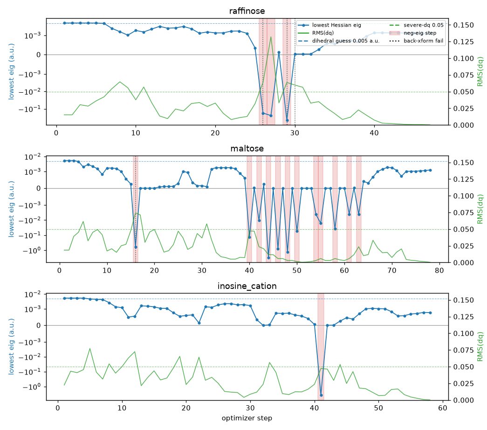

# Saddle-pass bursts: BFGS flips on a flat torsional manifold (issue #98)

This diagnostic branches off `benchmark_internals_diag` to attribute the three
"unattributed" rows in [`../triggers.md`](../triggers.md): **raffinose**,
**maltose**, and **inosine_cation**. Those molecules emit clusters of
`back-xform`, `neg-eig`, and `severe-dq` warnings on otherwise healthy
trajectories, with the pinv gap staying above `1e+11` the whole way and **no**
geometric flag (`angle≥175`, `planar-3coord`, `sp3-inverted`, `bond-stretch`)
firing. The triggers.md hypothesis was:

> BFGS Hessian flips / RFO saddle-mode descent on a flat torsional manifold.

**Verdict: confirmed.** The bursts are produced entirely inside the
Hessian/step machinery, not the coordinate system. There are two coupled
sub-mechanisms, and they explain why these three cases *recover* (unlike
caffeine, the sister case under #94, whose `neg-eig` is sustained rather than a
clean transient pass).

## Method

`run_diag.py` re-runs each molecule with `Berny(..., trace=...)` against the
default GFN2-xTB solver (`XTBSolver`) and merges, per step, the trace record
Berny already emits (`quadratic_step` eigenvalues / `lambda` / predicted ΔE /
step type) with the back-transformation outcome parsed from the INFO log. Each
step is tagged:

- `neg-eig` — `quadratic_step` saw ≥1 negative Hessian eigenvalue;
- `back-xform` — `update_geom` hit its 20-iteration cap (did not converge);
- `severe-dq` — total-step `RMS(dq) ≥ 0.05`.

Note this reproduces the **phenomenon**, not the exact MOPAC step numbers from
the original #92 sweep: GFN2-xTB is a different PES, so the warning steps land
at different indices (and xtb step counts are not bitwise-reproducible — see
`birkholz_schlegel/SOURCE.md`). All three still converge.



The blue trace is the lowest eigenvalue of the projected Hessian (symlog);
green is `RMS(dq)`. Red bands are `neg-eig` steps, dotted black lines are
`back-xform` failures. The dashed blue line is the dihedral Hessian-guess force
constant (0.005 a.u.); the dashed green line is the `severe-dq` threshold.

## What the data shows

Warning steps split cleanly into two regimes (full table in `merged.json`):

| regime | lowest eig | step type | what fires |
|---|---|---|---|
| **flat torsion** | small **positive** (1e-4 … 5e-3 a.u.) | pure `rfo` | `severe-dq` (± `back-xform`) |
| **saddle pass** | **negative** (−0.1 … −3.8 a.u.) | on-`sphere`, `λ ≈ ev[0]` | `neg-eig` (+ `severe-dq`/`back-xform`) |

Representative rows:

```
raffinose  st  7  severe-dq                     low_eig +2.5e-03  rfo
raffinose  st 26  neg-eig,back-xform,severe-dq  low_eig -1.7e-01  sphere  λ=-1.8e-01
raffinose  st 29  neg-eig,back-xform,severe-dq  low_eig -4.4e-01  sphere  λ=-4.5e-01
raffinose  st 30  back-xform,severe-dq          low_eig +3.4e-05  rfo-ish   (re-stiffened)
maltose    st 44  neg-eig                       low_eig -3.0e+00  sphere  λ=-3.0e+00
inosine    st 41  neg-eig                       low_eig -3.8e+00  sphere  λ=-3.8e+00
```

### 1. Flat torsional manifold → `severe-dq` (and its `back-xform` collateral)

At the pure `severe-dq` steps the lowest Hessian eigenvalue is **positive but
tiny** — 1e-4 to 5e-3 a.u. This is exactly the torsional softness scale built
into the Hessian guess: in `coords.py` the diagonal force constants are

- `Bond`: `0.45·ρ` (≈0.45 a.u.),
- `Angle`: `0.15·ρ²` (≈0.15 a.u.),
- `Dihedral`: `0.005·ρ³` (≈0.005 a.u.) — ~90× softer than a bond.

So the softest modes are torsions. With `trust = 0.3`, a modest gradient along a
~1e-3 a.u. mode produces a large internal-coordinate step (`RMS(dq) ≥ 0.05`).
Pushing that big a step across a *curved* torsional manifold is what
occasionally overruns the iterative back-transformation's 20-iteration cap, so
`back-xform` is a **consequence** of `severe-dq`, not a coordinate singularity.
These molecules (two sugars + a nucleoside) are floppy: many soft rotatable
bonds, hence many such steps early on (raffinose 7–11, inosine 5–33).

### 2. BFGS flip → RFO saddle-mode descent → `neg-eig`

At the `neg-eig` steps the lowest eigenvalue is genuinely **negative**. The
BFGS update (`berny.update_hessian`) has driven one soft mode below zero —
either because a curvature-decreasing torsional step is fit with a negative
secant curvature, or simply because the trajectory really does cross a shallow
ridge between rotamer basins. The quadratic step then leaves the pure-RFO
branch (its step exceeds trust) and minimizes **on the trust sphere**, with the
shift `λ` pushed just below the lowest eigenvalue (`λ ≈ ev[0] < 0` at every such
step — see the table). That is textbook RFO descent **along** the negative
mode: a controlled saddle pass.

### 3. Why they recover

The negative eigenvalue is **transient** — one to three steps. After the pass
the BFGS Hessian re-stiffens (e.g. raffinose drops back to `+3e-5` at step 30,
maltose's late `neg-eig` flickers shrink toward the `1e-2` scale as RMS(dq)
decays to convergence), the steps shrink, and the optimizer settles. This is
the key contrast with **caffeine** (#94): there the `neg-eig` is *sustained*
over ~20 steps and the run crashes in back-transformation — a genuinely rough
PES, not a clean transient pass. The shared vocabulary (`neg-eig`) hid two
different stories; here the flip is a feature of the algorithm working as
designed, there it is a symptom.

## Conclusion

The three #98 cases are **not** a bug and **not** a coordinate-singularity
pathology (the pinv gap never narrows, no near-linear angle or planar centre is
involved). They are the normal, recoverable behaviour of an RFO/BFGS optimizer
crossing shallow torsional ridges on very floppy molecules:

- `severe-dq` ← soft torsional modes (Hessian-guess `0.005·ρ³`) × `trust=0.3`;
- `back-xform` ← collateral of those large steps on a curved manifold;
- `neg-eig` ← transient BFGS flip handled correctly by on-sphere RFO descent.

No code change is warranted by these three cases on their own. The
triggers.md rows are reclassified from `unattributed` to
`bfgs-flip/flat-torsion`.

## Reproduce

```
python run_diag.py     # writes traces/, merged.json, saddle_pass.png
```

(Per the experiments convention only this `README.md` and `saddle_pass.png` are
committed; `run_diag.py`, `traces/`, and `merged.json` are scratch.)
