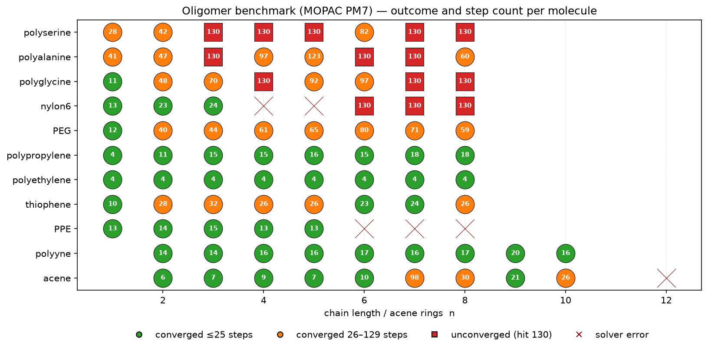
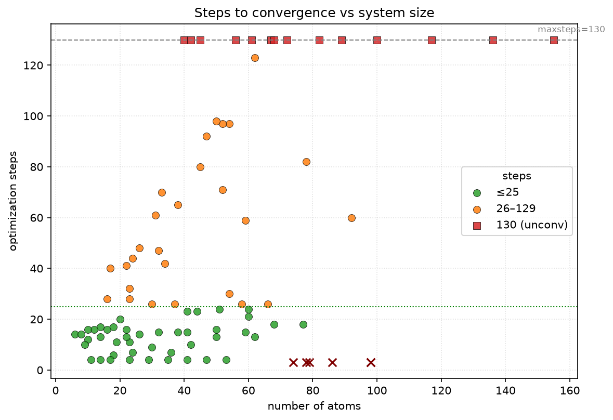
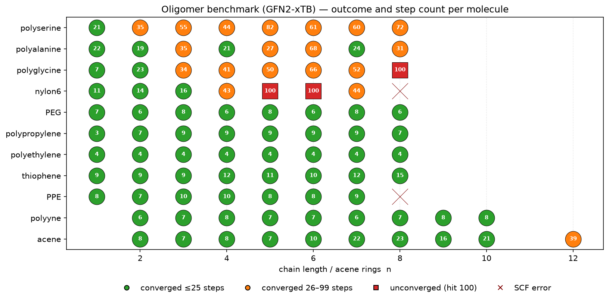
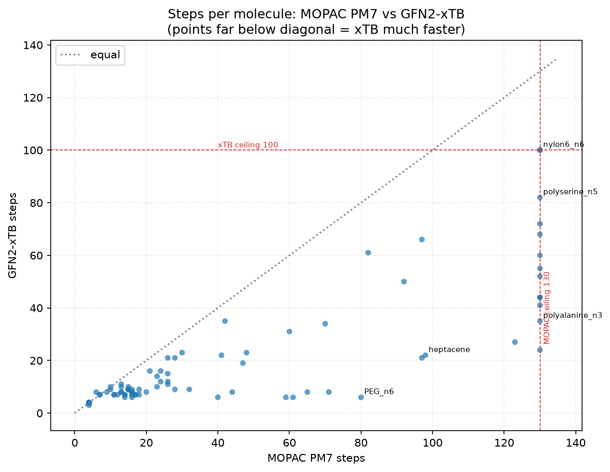
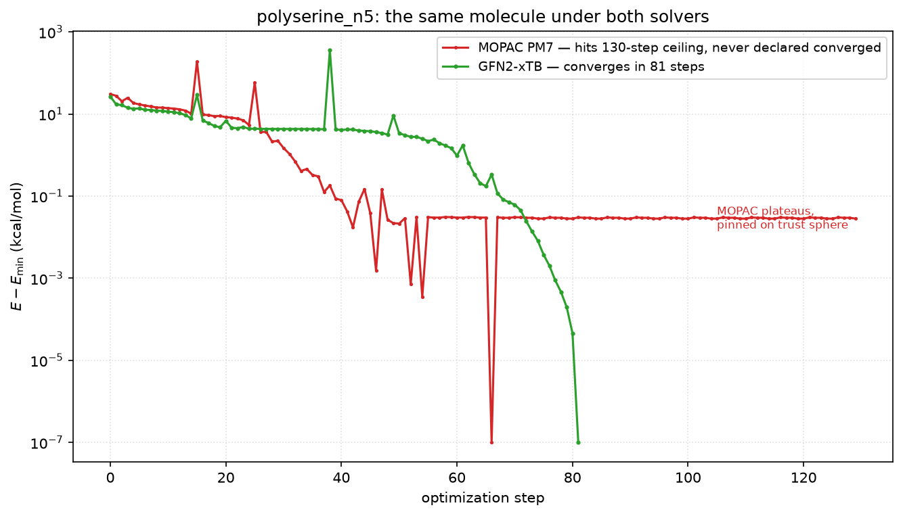

# Oligomer benchmark convergence analysis

## Motivation

PR #127 wires the [ghutchis/oligomer-benchmarks](https://github.com/ghutchis/oligomer-benchmarks)
set (91 neutral C/H/N/O/S organics across 11 chain-length series) into the
benchmark machinery. This experiment dissects the baseline runs to understand
*why* molecules fail to converge, beyond the headline pass count.

It covers two solver backends in sequence:

- the original **MOPAC PM7** baseline, and
- the **GFN2-xTB** baseline produced after the default runner was switched
  from MOPAC to xTB (#14x).

The switch is the headline result: the pass rate goes from 71/91 to 86/91, the
total step count roughly halves, and the dominant MOPAC failure mode disappears
entirely. The two sections below analyse each run with the same method; the
final section compares them directly.

## Method

For each run, two artifact layers were analysed:

- the six batch shards (`<solver>-oligomers-b{0..5}.json`) for the
  authoritative per-molecule `converged` / `steps` / `error` verdicts, and
- the 85–91 per-molecule **trace** files (`*.trace.json`, written by
  `benchmark.py --out-trace-dir`), which record for every step the energy, the
  four convergence criteria with their values and thresholds, and the
  quadratic-step internals (`trust_radius`, `on_sphere`, `step_type`,
  `n_negative_eigenvalues`, `lambda`, `predicted_energy_change`).

The traces are what make the failure modes legible: a `converged: false`
verdict alone cannot distinguish "still far off" from "gradients met, blocked
on a technicality".

Sources: the MOPAC run is
[Actions 27788730175](https://github.com/jhrmnn/pyberny/actions/runs/27788730175)
(`Berny(maxsteps=130, trust=0.3, energy_noise=2e-7)`); the xTB run is
[Actions 27838116916](https://github.com/jhrmnn/pyberny/actions/runs/27838116916)
(`Berny(geom, trace=...)` with defaults: `maxsteps=100, trust=0.3,
energy_noise=2e-8`). Note the xTB run uses the *tight* default noise gate, not
the widened `2e-7` MOPAC needed — xTB's analytic energies don't require it.

---

## Part 1 — MOPAC PM7

| Outcome | Count | Share |
|---|---:|---:|
| Converged ≤ 25 steps | 44 | 48% |
| Converged 26–129 steps | 27 | 30% |
| Unconverged (hit `maxsteps=130`) | 14 | 15% |
| Solver error | 6 | 7% |
| **Total** | **91** | |

71/91 converged. The 20 non-converging runs consumed **1213 s of the 1484 s**
total wall time.

**Outcome tracks chemistry, not size.** Rigid backbones (acenes, poly-ynes,
PPE, thiophene, polyethylene, polypropylene) converge fast and *length-
independently* — polyethylene is 4 steps at every length. Flexible / H-bonding
backbones (PEG ethers, the three peptides, longer nylon-6) degrade with chain
length and supply every ceiling case. 78-atom decacene converges in 26 steps
while 42-atom polyalanine_n3 never does.

### The dominant MOPAC failure mode: locked on the trust sphere

All 14 ceiling cases share one signature: at the final step the optimizer is
taking a trust-region–limited step (`on_sphere = True`). When the step is
truncated to the trust sphere, `is_converged` (`src/berny/berny.py:558`)
replaces the two step-size criteria with a single hard-coded
`('Minimization on sphere', False)` entry, so the run *cannot* be declared
converged while it is pinned to the sphere — no matter how small the gradient.
This is faithful Birkholz–Schlegel behaviour, but for floppy systems near a
noisy flat minimum the optimizer never gets off the sphere.

Sorting the 14 by final gradient relative to threshold:

| Sub-mode | Molecules | Trace signature |
|---|---|---|
| **Converged, mislabeled** (both gradient criteria already matched) | `polyserine_n5`, `polyalanine_n7` | Gradient RMS *and* max below threshold for the last ~70 steps; only `Minimization on sphere` unmet. |
| **Essentially there, trust collapsed** (grad-max < 5×) | `nylon6_n6`, `polyalanine_n3`, `polyglycine_n7`, `polyserine_n3`, `polyserine_n7` | Trust radius collapsed to ~1e-4–1e-5; gradient max 2–5× over; energy flat. |
| **Genuinely oscillating** (grad-max ≥ 5×) | `nylon6_n7` (617×), `nylon6_n8` (75×), `polyglycine_n8` (15×), `polyserine_n8`, `polyalanine_n6`, `polyglycine_n4`, `polyserine_n4` | Trust radius moderate; energy *rises* on 20–30% of steps; recurrent negative Hessian eigenvalue. |

So 7 of the 14 "failures" are within a whisker of the minimum; only 7 truly
oscillate. The mislabeling is driven by a trust-radius sawtooth: PM7 energy
noise near a flat minimum repeatedly shrinks then regrows the trust radius,
keeping every step on the sphere.

### The 6 MOPAC errors are interface bugs, not optimizer failures

All originate in the MOPAC plumbing (`src/berny/solvers.py`) or the line search:

| Molecule | Error | Root cause |
|---|---|---|
| `nylon6_n4`, `nylon6_n5` | `could not convert string to float: 'KCAL/ANGSTROM'` | Fixed-column gradient parse (`solvers.py:104`, `split()[6]`) lands on the units token. |
| `PPE_n7`, `dodecacene` | `generator raised StopIteration` | Bare `next(...)` exhausts the output file when MOPAC didn't emit the expected block (PEP 479). |
| `PPE_n8` | `Cannot find f(x) > 0` | Line-search bracketing failure (`Math.py:135`) on step 1. |
| `PPE_n6` | bare `AssertionError` | Linear-bend coordinate handling (`coords.py`). |

Three of six are the longest PPE chains (near-linear C≡C–aryl junctions). These
are tracked in #130; the convergence gate is tracked in #129.

---

## Part 2 — GFN2-xTB

| Outcome | Count | Share |
|---|---:|---:|
| Converged ≤ 25 steps | 67 | 74% |
| Converged 26–99 steps | 19 | 21% |
| Unconverged (hit `maxsteps=100`) | 3 | 3% |
| SCF error | 2 | 2% |
| **Total** | **91** | |

86/91 converged in **1899 total steps / 797 s** — roughly half the MOPAC run's
3917 steps / 1484 s.

The same family structure holds — rigid backbones are trivial (polyethylene 4,
poly-yne ~7, acenes single-to-low-double digits), flexible chains cost more —
but the threshold for *failing* has moved right out to the very longest, most
flexible chains. The two biggest acenes that MOPAC couldn't finish (decacene,
dodecacene) now converge in 21 and 39 steps.

### What's left unconverged is genuine oscillation, not mislabeling

The 3 ceiling cases — `nylon6_n5`, `nylon6_n6`, `polyglycine_n8` — are all
*genuinely* far from the gradient thresholds at step 100 (gradient max 8×, 8×,
and 70× over respectively), with energy increases and a recurrent negative
Hessian eigenvalue. Unlike MOPAC, **none** are converged-but-mislabeled: the
`Minimization on sphere` false-negative mode has effectively vanished, because
xTB's smooth analytic PES removes the trust-radius sawtooth that pinned MOPAC to
the sphere. These three are the hard core of competing-conformer flexible
chains — the same molecules that formed MOPAC's "genuinely oscillating" subset.

### The 2 xTB errors are electronic-structure, not optimizer or parsing

`PPE_n8` (98 atoms) and `nylon6_n8` (155 atoms) fail with
`TBLiteRuntimeError: SCF not converged in 250 cycles` — the GFN2-xTB
self-consistent field didn't converge for a geometry along the path, on the two
largest systems in the set. `PPE_n8` fails on the very first SCF; `nylon6_n8`
optimized cleanly for 44 steps before hitting a geometry the SCF couldn't
solve. This is a solver (tblite) limit, distinct in kind from MOPAC's
output-parsing fragility — there is no pyberny-side parse or assertion involved.

---

## Part 3 — MOPAC vs xTB, side by side

Almost every molecule sits below the diagonal: xTB converges in fewer steps.
The cluster pinned against the MOPAC ceiling (130) spreads down to 24–82 xTB
steps — i.e. 11 of MOPAC's 14 ceiling cases converge under xTB; only
`nylon6_n6` and `polyglycine_n8` still hit the ceiling, and `nylon6_n8` trades
its ceiling for an SCF error.

The most striking shift is **PEG**, which collapses from 40–80 MOPAC steps to a
flat 6–8 under xTB:

| | n1 | n2 | n3 | n4 | n5 | n6 | n7 | n8 |
|---|--:|--:|--:|--:|--:|--:|--:|--:|
| MOPAC | 12 | 40 | 44 | 61 | 65 | 80 | 71 | 59 |
| xTB | 7 | 6 | 8 | 6 | 8 | 6 | 8 | 6 |

PEG's apparent difficulty under MOPAC was never intrinsic — the soft ether-
torsion manifold was being whipped around by PM7 energy noise. On a smooth PES
it is one of the easiest families in the set.

`polyserine_n5` is the cleanest single illustration. Under MOPAC it plateaus
~0.03 kcal/mol above its minimum and rides the trust sphere for 98% of all 130
steps without ever being declared converged; under xTB the very same molecule
descends monotonically and converges in 81 steps:

## Conclusions

1. **Switching MOPAC → GFN2-xTB is a large, clean win**: 71→86 converged,
   ~2× fewer steps and wall-time, and the two biggest acenes recovered.
2. **The MOPAC `Minimization on sphere` false-negative mode is gone.** It was
   an interaction between PM7 energy noise and the trust-region controller, not
   a property of the molecules — xTB's smooth analytic gradients remove it, so
   the peptides/PEGs/nylons that MOPAC mislabeled now converge normally (PEG
   becoming nearly free). This is strong evidence that issue #129 is, in
   practice, a *noisy-PES* problem; it still matters for any noisy backend.
3. **The residual xTB non-convergence is real and small.** Three flexible
   H-bonding chains (two nylon-6, one long polyglycine) genuinely oscillate
   between conformers — the irreducible hard core, not a thresholding artifact.
4. **The error class changed.** MOPAC's failures were pyberny-side interface
   fragility (#130, recoverable with better parsing). xTB's two failures are
   tblite SCF non-convergence on the largest systems — an electronic-structure
   limit, outside the optimizer.

## Reproduction

Download the two runs' artifacts (batch shards + `*.trace.json` traces) from
Actions [27788730175](https://github.com/jhrmnn/pyberny/actions/runs/27788730175)
(MOPAC) and [27838116916](https://github.com/jhrmnn/pyberny/actions/runs/27838116916)
(xTB), then classify each molecule from its trace by reading the final-step
`convergence.criteria` (gradient values vs thresholds) and the per-step
`quadratic_step.on_sphere` / `trust_radius` fields. The figures here are the two
outcome grids, the MOPAC steps-vs-size scatter, the MOPAC `locked_on_sphere`
trace, the per-molecule MOPAC-vs-xTB step scatter, and the `polyserine_n5`
two-solver overlay.
