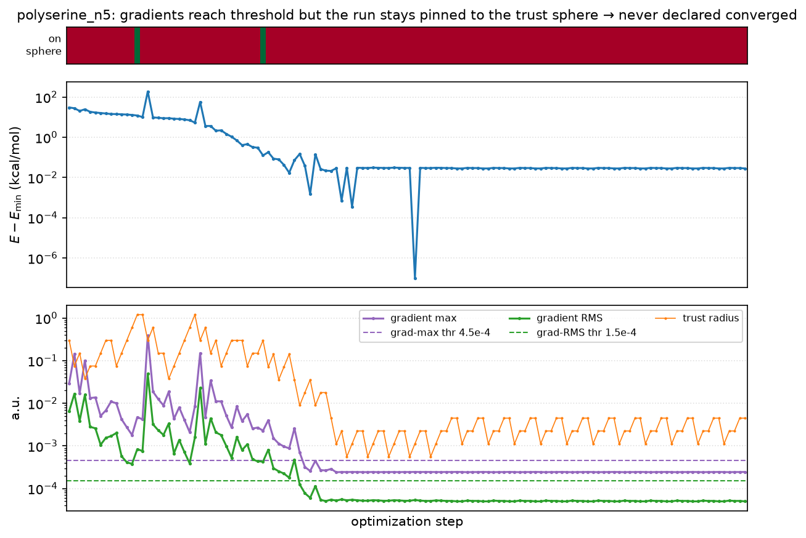

# Oligomer benchmark convergence analysis

## Motivation

PR #127 wires the [ghutchis/oligomer-benchmarks](https://github.com/ghutchis/oligomer-benchmarks)
set (91 neutral C/H/N/O/S organics across 11 chain-length series) into the
benchmark machinery and launched the first baseline run. This experiment
dissects that run to understand *why* a sizeable fraction of the molecules
fail to converge, beyond the headline "71/91 converged".

## Method

Source data: the unseeded `workflow_dispatch` baseline,
[Actions run 27788730175](https://github.com/jhrmnn/pyberny/actions/runs/27788730175)
(MOPAC PM7, `Berny(maxsteps=130, trust=0.3, energy_noise=2e-7)`), commit
`bfb8cf9` of PR #127's branch.

Two artifact layers were analysed:

- the six batch shards (`mopac-oligomers-b{0..5}.json`) for the authoritative
  per-molecule `converged` / `steps` / `error` verdicts, and
- the 85 per-molecule **trace** files (`*.trace.json`, written by
  `benchmark.py --out-trace-dir`), which record for every step the energy, the
  four convergence criteria with their values and thresholds, and the
  quadratic-step internals (`trust_radius`, `on_sphere`, `step_type`,
  `n_negative_eigenvalues`, `lambda`, `predicted_energy_change`).

The traces are what make the failure modes legible: a `converged: false`
verdict alone cannot distinguish "still 600× off" from "gradients met, blocked
on a technicality".

## Results at a glance

| Outcome | Count | Share |
|---|---:|---:|
| Converged ≤ 25 steps | 44 | 48% |
| Converged 26–129 steps | 27 | 30% |
| Unconverged (hit `maxsteps=130`) | 14 | 15% |
| Solver error | 6 | 7% |
| **Total** | **91** | |

71/91 converged. The 20 non-converging runs (14 ceiling + 6 errors) consumed
**1213 s of the 1484 s** total wall time — the failures are also where almost
all the compute goes.

The single most important observation is that **outcome tracks chemistry, not
size**. The families split cleanly into two camps:

- **Rigid / low-flexibility backbones converge fast and flat.** Acenes,
  poly-ynes, PPE, thiophene, polyethylene and polypropylene converge in a
  handful to a few-dozen steps with *no* dependence on chain length —
  polyethylene is 4 steps at every length n1…n8; polypropylene plateaus at
  ~15–18; poly-yne at ~16–20. These backbones have stiff, well-separated normal
  modes that the model Hessian captures well.
- **Flexible / hydrogen-bonding backbones degrade as they grow.** Every
  unconverged run and most of the slow ones are PEG ethers or the three
  peptides (poly-gly / -ala / -ser) plus longer nylon-6. Their soft torsional
  manifolds and intramolecular H-bond networks create many low-curvature
  directions and competing local minima, so step count climbs steeply with n
  and eventually blows through the 130-step ceiling.

Plotted against atom count the two camps are unmistakable: a flat green floor of
rigid systems regardless of size, and a rising orange/red plume of flexible
chains. Size *per se* is not the predictor — the 78-atom decacene converges in
26 steps while 42-atom polyalanine_n3 never converges.

## The dominant non-convergence mechanism: locked on the trust sphere

All 14 ceiling cases share one signature: at the final step the optimizer is
taking a **trust-region–limited step** (`on_sphere = True`). When the step is
truncated to the trust sphere, `is_converged` (`src/berny/berny.py:558`)
replaces the two step-size criteria with a single hard-coded
`('Minimization on sphere', False)` entry — so the run *cannot* be declared
converged while it is pinned to the sphere, no matter how small the gradient
is. This is faithful Birkholz–Schlegel behaviour (a converged minimum should
sit at an interior RFO step, not against the trust boundary), but for these
floppy systems the optimizer never gets off the sphere.

Sorting the 14 ceiling cases by their **final gradient** relative to threshold
reveals three sub-modes:

| Sub-mode | Molecules | What the trace shows |
|---|---|---|
| **Genuinely converged, mislabeled** (both gradient criteria already matched) | `polyserine_n5`, `polyalanine_n7` | Gradient RMS *and* max are below threshold for the last ~70 steps; the only unmet criterion is `Minimization on sphere`. A real false-negative. |
| **Essentially there, trust collapsed** (grad-max < 5× threshold) | `nylon6_n6`, `polyalanine_n3`, `polyglycine_n7`, `polyserine_n3`, `polyserine_n7` | Trust radius has collapsed to ~1e-4–1e-5; steps are microscopic, gradient max sits 2–5× over threshold, energy is flat. Stalled just short. |
| **Genuinely oscillating** (grad-max ≥ 5× threshold) | `nylon6_n7` (617×!), `nylon6_n8` (75×), `polyglycine_n8` (15×), `polyserine_n8` (10×), `polyalanine_n6`, `polyglycine_n4`, `polyserine_n4` | Trust radius stays moderate (0.04–0.08), energy *rises* on 20–30% of steps, ≥1 negative Hessian eigenvalue recurs. The optimizer is hopping between competing conformers, not settling. |

So of the 14 "failures", **7 are within a whisker of the minimum** (2 already
meet the gradient test, 5 are within 5×) and only **7 are truly oscillating**.

`polyserine_n5` is the cleanest illustration of the false-negative mode:

After ~step 55 the energy is pinned at its minimum and **both** gradient norms
sit at/below their thresholds (green and purple traces under their dashed
lines) for the entire remaining run. But the trust radius sawtooths — collapse,
grow, collapse — keeping every step on the sphere (`on_sphere = True` for 98% of
the run, red strip), so the `Minimization on sphere` criterion never clears and
the optimizer burns all 130 steps on an already-converged structure.

The sawtooth itself is the trust-region controller reacting to PM7 energy noise
near a flat minimum: tiny predicted-vs-actual energy mismatches repeatedly
shrink the trust radius, which then re-expands, never letting a clean interior
step through.

## Slow-but-successful runs are mostly benign

The 27 runs in the 26–129 band are dominated by PEG and the shorter peptides.
The PEG series is illuminating: PEG_n4…n8 take 59–80 steps but with **near-zero
energy increases** (PEG_n8: a single uphill step in 59) and a trust radius that
*grows* (PEG_n5 reaches 1.2). These are not oscillating — they are smooth,
monotone descents that are simply *slow* because the soft ether-torsion
manifold gives the model Hessian little curvature to work with. heptacene (98
steps, 36 uphill steps) is the exception in this band: a rigid acene that
nonetheless oscillates, plausibly from near-degenerate ring-breathing modes.

## The 6 solver errors are MOPAC-interface bugs, not optimizer failures

All six errors originate in the MOPAC plumbing (`src/berny/solvers.py`
`MopacSolver`) or the line-search, and they cluster on specific chemistries:

| Molecule | Error | Root cause |
|---|---|---|
| `nylon6_n4`, `nylon6_n5` | `ValueError: could not convert string to float: 'KCAL/ANGSTROM'` | Fixed-column gradient parse at `solvers.py:104` (`next(f).split()[6]`) lands on the `KCAL/ANGSTROM` units token instead of a number — the "FINAL POINT AND DERIVATIVES" block layout varies and the parser is brittle. |
| `PPE_n7`, `dodecacene` | `RuntimeError: generator raised StopIteration` | Bare `next(...)` calls (`solvers.py:97–104`) exhaust the output file when MOPAC didn't emit the expected block; under PEP 479 the `StopIteration` escaping the solver generator is re-raised as `RuntimeError`. The real cause (missing/truncated MOPAC output) is masked. |
| `PPE_n8` | `RuntimeError: Cannot find f(x) > 0` | Line-search quartic/cubic fit (`Math.py:135`) fails to bracket on step 1 of the largest PPE (98 atoms). |
| `PPE_n6` | `AssertionError` | Bare assert (reached step 4), almost certainly in the linear-bend coordinate handling (`coords.py`) — see below. |

Note the PPE clustering: three of the six errors are the three longest
poly(phenylene-ethynylene) chains, which are wall-to-wall near-linear
C≡C–aryl junctions. That is exactly the linear-bend coordinate regime touched
by the recent #104/#122 work, so PPE_n6's bare assertion and PPE_n7/n8's
downstream failures are likely the same underlying linear-coordinate stress
surfacing in different places. dodecacene (the only acene error) is the largest
acene and fails the same StopIteration way as PPE_n7 — i.e. a MOPAC-output
problem on the biggest system rather than an acene-specific optimizer issue.

## Conclusions

1. **Convergence is governed by backbone flexibility, not system size.** Rigid
   π-systems and saturated hydrocarbons converge fast and length-independently;
   flexible ethers, peptides and longer nylons degrade with chain length. Any
   per-row seeding of `mopac_pm7_steps` should expect this bimodal split.
2. **The `Minimization on sphere` gate is the proximate cause of half the
   "failures".** 7 of 14 ceiling cases are at or within 5× of the gradient
   thresholds; 2 already satisfy both gradient criteria and are blocked purely
   because the trust-region step is sphere-truncated. The trust-radius sawtooth
   driven by PM7 energy noise keeps these runs on the sphere indefinitely.
   Worth investigating: allowing convergence on a sphere-limited step once the
   gradient criteria are comfortably met, or damping trust-radius collapse near
   a noisy flat minimum.
3. **The other 7 ceiling cases genuinely oscillate** between conformers with a
   recurrent negative Hessian eigenvalue — a harder, real optimization problem
   (multiple competing minima on a floppy PES), not a thresholding artifact.
4. **The 6 errors are solver-interface fragility, not optimizer divergence.**
   The MOPAC gradient parser (fixed-column `split()[6]`) and its bare `next()`
   calls fail opaquely when MOPAC's output deviates or is truncated; the PPE
   cluster additionally points at linear-bend coordinate handling. These are
   the most actionable fixes: robust gradient parsing and a clear error when the
   derivatives block is missing would recover at least the 2 nylon-6 and
   2 StopIteration cases without touching the optimizer.

## Reproduction

Download the run's artifacts (batch shards + `*.trace.json` traces) from
[Actions run 27788730175](https://github.com/jhrmnn/pyberny/actions/runs/27788730175),
then classify each molecule from its trace by reading the final-step
`convergence.criteria` (gradient values vs thresholds) and the per-step
`quadratic_step.on_sphere` / `trust_radius` fields. The three figures here are
(1) the outcome grid, (2) steps vs atom count, and (3) the per-step energy,
gradient and trust-radius trace of `polyserine_n5`.
