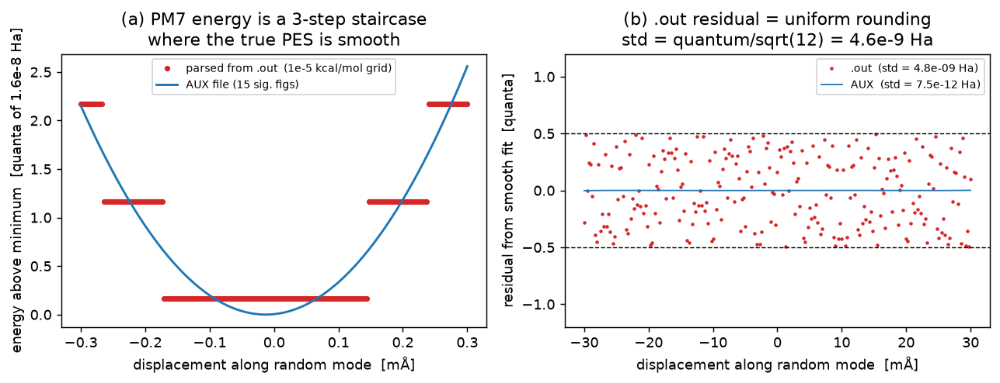
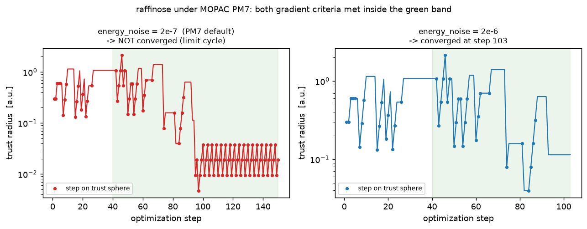
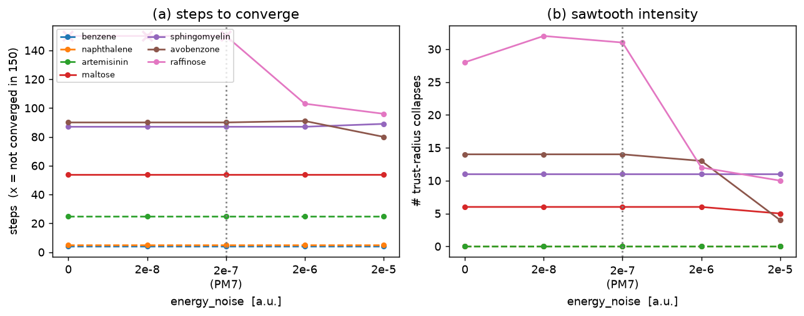

# PM7 energy noise near flat minima

## TL;DR

This is the characterization [#132](https://github.com/jhrmnn/pyberny/issues/132)
asked for: *what is MOPAC PM7's per-evaluation energy precision, and is
that what destabilizes the trust radius at flat minima?*

Three findings, the third of which reframes the question:

1. **PM7's SCF is bit-for-bit deterministic.** The same geometry
   evaluated repeatedly returns an *identical* energy — there is no
   run-to-run jitter to characterize.

2. **The only "noise" is print quantization.** pyberny's `MopacSolver`
   parses `FINAL HEAT OF FORMATION` from the `.out` file, which MOPAC
   prints to `1e-5 kcal/mol` — a grid of **1.6e-8 Ha**. The underlying
   energy is far smoother: the same run's `AUX` file carries the heat of
   formation to 15 significant figures, and reading *that* drops the
   effective noise by ~1000×. So the per-evaluation noise floor pyberny
   sees is a *parsing artifact*, fixed in size at `quantum/sqrt(12) ≈
   4.6e-9 Ha`, and **not** a property of PM7.

   

3. **That floor is ~100× too small to be what drives the sawtooth.** At
   the flat minima where the trust radius collapses/regrows (raffinose),
   the *actual* step-to-step energy change is `4e-7 … 2e-6 Ha` — i.e.
   **25–140 quanta**, far above the noise floor. The sawtooth is not the
   optimizer choking on noise; it is a **deterministic limit cycle of the
   discrete Fletcher rule** reacting to genuine small overshoots near a
   soft minimum. `energy_noise` helps only because its guard
   (`|ΔE_predicted| < 10·energy_noise`) *freezes* the trust update in that
   flat region — it is really a flat-region detector keyed to the
   *predicted-ΔE* scale (~1e-6 Ha), not to the 1.6e-8 Ha noise floor.
   That is why the empirical PM7 value `2e-7` is ~12× the measured floor
   rather than equal to it.

   

## Background

`update_trust` in [`src/berny/berny.py`](../../src/berny/berny.py)
computes Fletcher's ratio `r = ΔE_actual / ΔE_predicted` and shrinks
(`r < 0.25` → `trust = |Δq|/4`), grows (`r > 0.75` and on-sphere →
`trust = 2·trust`), or keeps. A side branch suppresses the update when
`|ΔE_predicted| < 10·energy_noise` to avoid acting on a meaningless
ratio. `energy_noise` defaults to `2e-8 Ha` and was bumped to `2e-7` for
PM7 in [#123](https://github.com/jhrmnn/pyberny/issues/123) "somewhat
empirically"; [#132](https://github.com/jhrmnn/pyberny/issues/132) and
the [`fletcher_sweep`](../fletcher_sweep/) follow-up both flagged
"characterize the noise / vary `energy_noise`" as open.

The signature to explain (from #129 / #131) is a molecule whose gradients
are already at threshold and whose energy is pinned at its minimum, yet
whose trust radius collapses and regrows while every step stays
`on_sphere`. The `birkholz` floppy ethers/sugars are the reproducible
candidates; rigid aromatics are the controls.

## Method

All runs use the bundled `birkholz`/`baker` benchmarks with
`Berny + MopacSolver(PM7)` and MOPAC 23.2.5. Three probes:

1. **Determinism / quantization.** Re-evaluate one fixed geometry
   (maltose) five times; then optimize maltose to its PM7 minimum and
   scan the energy along a fixed random Cartesian direction through it,
   reading *both* the `.out` heat of formation (the 1e-5 kcal/mol grid)
   and the `AUX(PRECISION=9)` value (15 sig. figs) at each point.
   Residuals are taken against a smooth quartic fit of the AUX curve.

2. **Sawtooth anatomy.** Optimize raffinose and record the per-step
   trace (`Berny(..., trace=...)`): trust radius, `on_sphere`, Fletcher
   `r`, the `below_noise` flag, and each convergence criterion.

3. **`energy_noise` sweep.** Run seven molecules — four floppy
   reproducible candidates (`maltose`, `sphingomyelin`, `avobenzone`,
   `raffinose`) and three stiff controls (`benzene`, `naphthalene`,
   `artemisinin`) — at `energy_noise ∈ {0, 2e-8, 2e-7, 2e-6, 2e-5}`,
   recording steps, convergence, on-sphere fraction, and the number of
   trust-radius collapses (the sawtooth count). `maxsteps = 150`.

### Caveats

- **The geometry must be near a minimum for the staircase to show.** Along
  a random direction the curvature is stiff (~0.8 Ha/Ų), so the flat
  window where `ΔE_true ≲ a few quanta` is only ~±0.3 mÅ wide; the left
  panel of `noise_floor.png` is exactly that window.
- **This branch predates [#131](https://github.com/jhrmnn/pyberny/issues/131).**
  `is_converged` still fails on any `on_sphere` step, so raffinose's
  non-convergence here is the #129 false negative, not a physical
  failure — the gradients are met (see below).
- **PM7 step counts are not bit-reproducible across runners**
  (see [`birkholz_schlegel/SOURCE.md`](../../src/berny/benchmarks/birkholz_schlegel/SOURCE.md));
  the ±1-step entries below would jitter on a rerun, but the
  qualitative split (controls flat, raffinose rescued only at `2e-6`) is
  stable.

## Results

### 1. The noise is deterministic print quantization

Five repeats of the maltose single point returned the identical energy to
all parsed digits (spread `0.0 Ha`). PM7 SCF has **no stochastic jitter**.

The fixed-geometry scan (`noise_floor.png`) shows what the optimizer
actually sees. Over a ±0.3 mÅ window where the true (AUX) energy rises by
2.6 quanta, the `.out` energy takes **3 distinct values** — a literal
staircase — while the AUX energy is smooth (201 distinct values over the
same 201 points). On the wider scan, the `.out` residual from the smooth
fit fills a uniform `±½-quantum` band with `std = 4.8e-9 Ha`, matching the
ideal rounding value `quantum/sqrt(12) = 4.6e-9 Ha`; the AUX residual is
`~5e-12 Ha`. The floor is therefore fixed at **1.6e-8 Ha**, set by the
output format, not by PM7.

### 2. The sawtooth is a deterministic trust limit cycle

raffinose at the PM7 default `energy_noise = 2e-7` never converges in 150
steps. From ~step 95 on, the trust radius settles into a clean **period-3
cycle**

```
3.8e-2  --(r = -0.79 < 0.25: collapse to |Δq|/4)-->  9.4e-3
9.4e-3  --(ΔE_pred below guard: ×2)-->              1.9e-2
1.9e-2  --(ΔE_pred below guard: ×2)-->              3.8e-2   (repeat)
```

while **both gradient criteria are already satisfied on 59 of the last 60
steps** (left panel of `sawtooth.png`, green band). The actual energy
oscillates `+4e-7 → +1.7e-6 → −2.2e-6 Ha` — all 25–140 quanta, so this is
*real* motion, not rounding. The `r = -0.79` collapse step is a genuine
overshoot: the on-sphere step is large enough that the energy rises. This
is #129's "direction 2".

Raising `energy_noise` to `2e-6` lifts the guard (`10·2e-6 = 2e-5`) above
the whole predicted-ΔE band (~1e-6), so *every* near-minimum step is
flagged `below_noise`, the trust radius **freezes** at 0.11, the step
drops inside the sphere (pure RFO, `on_sphere = False`), and the run
converges at step 103 (right panel).

### 3. `2e-7` barely moves the convergers; raffinose needs `2e-6`

Steps to converge (`*` = not converged in 150); `osf` = on-sphere
fraction at `2e-8`:

| molecule | osf | `0` | `2e-8` | **`2e-7`** | `2e-6` | `2e-5` |
|---|---:|---:|---:|---:|---:|---:|
| benzene (control)      | 0.00 |   4 |   4 |   4 |   4 |   4 |
| naphthalene (control)  | 0.00 |   5 |   5 |   5 |   5 |   5 |
| artemisinin (control)  | 0.08 |  25 |  25 |  25 |  25 |  25 |
| maltose                | 0.35 |  54 |  54 |  54 |  54 |  54 |
| sphingomyelin          | 0.44 |  87 |  87 |  87 |  87 |  89 |
| avobenzone             | 0.56 |  90 |  90 |  90 |  91 |  80 |
| **raffinose**          | 0.64 | 150\* | 150\* | **150\*** | **103** | 96 |

Trust-radius collapses over the run (the sawtooth count):

| molecule | `0` | `2e-8` | **`2e-7`** | `2e-6` | `2e-5` |
|---|---:|---:|---:|---:|---:|
| benzene / naphthalene / artemisinin | 0 | 0 | 0 | 0 | 0 |
| maltose        |  6 |  6 |  6 |  6 |  5 |
| sphingomyelin  | 11 | 11 | 11 | 11 | 11 |
| avobenzone     | 14 | 14 | 14 | 13 |  4 |
| raffinose      | 28 | 32 | 31 | **12** | 10 |



Reading across (`noise_sweep.png`, dotted line = PM7 `2e-7`):

- **The stiff controls never sawtooth.** 0 % on-sphere, 0 collapses, step
  count identical at every `energy_noise`. `energy_noise` changes only
  their `below_noise` *bookkeeping*, never their path.
- **For molecules that already converge, `2e-7` is a no-op.** maltose,
  sphingomyelin and avobenzone have the *same* step count and the *same*
  collapse count from `0` through `2e-6`; their sawtooth (6–14 collapses)
  is untouched by the PM7 value. They converge anyway because they reach
  gradient threshold *off* the sphere before the cycle can trap them.
- **`2e-7` does not break raffinose's cycle** — 31 collapses, still
  non-converged at 150. Only `2e-6` cuts it to 12 collapses and lets it
  converge. So the empirical PM7 value sits *below* what the hardest
  reproducible case needs.
- The far end (`2e-5`) starts distorting good runs (avobenzone 90→80
  steps, sphingomyelin 87→89), confirming there is a real upper bound —
  too large a guard freezes the trust radius where it shouldn't.

## Conclusions

1. **There is no PM7 "energy noise" to model.** The SCF is deterministic;
   the entire floor is the `1e-5 kcal/mol` print grid of the `.out` file
   (`1.6e-8 Ha`, `std 4.6e-9`). Reading the `AUX` heat of formation
   instead removes ~3 orders of magnitude of it for free — a cheaper,
   more honest lever than tuning `energy_noise`, and worth considering in
   `MopacSolver`.

2. **The `2e-7` floor does not "match the noise" — it can't.** The noise
   is `1.6e-8 Ha`; `2e-7` is 12× larger by *necessity*, because what it
   has to clear is the *predicted-ΔE* magnitude near a flat minimum
   (~`1e-6 Ha`), which is ~100× the noise. `energy_noise` is misnamed for
   this regime: it acts as a **predicted-ΔE threshold that freezes the
   trust update in flat regions**, not as a measurement-noise estimate.

3. **The sawtooth is the discrete trust rule, not the solver.** It is a
   deterministic period-3 limit cycle (collapse-on-overshoot,
   grow-twice-below-noise) that a *smooth* solver of the same flatness
   would also exhibit; the quantization is not its cause. This supports
   the #132 framing that a continuous / noise-aware trust update is the
   structural fix, with [#131](https://github.com/jhrmnn/pyberny/issues/131)'s
   sphere-convergence gate the orthogonal lever that actually rescues
   raffinose in production — `energy_noise = 2e-7` alone does not.

## Suggested follow-ups

- **Parse `AUX` instead of `.out` in `MopacSolver`.** It is a one-line
  change that lowers the noise floor by ~1000× and would let the *default*
  `energy_noise = 2e-8` stand for PM7; worth checking whether it removes
  the need for the PM7-specific bump entirely.
- **Re-derive the PM7 `energy_noise` from the predicted-ΔE scale.** The
  data say the relevant quantity is `min |ΔE_predicted|` near
  convergence (~`1e-6` for raffinose), not the noise floor; a value
  keyed to that (≈`2e-6`) is what actually quells the cycle.
- **Continuous trust update.** The period-3 cycle is exactly the kind of
  pathology a discrete three-branch rule produces; a Levenberg-style or
  damped update would not limit-cycle. (Also raised by `fletcher_sweep`.)
- **Repeat on the #127 oligomers** (`polyserine_n5`, …) once that
  submodule is available — the issue flags them as the cleanest, most
  on-sphere flat-minimum cases.

## Reproducing

The driver scripts and raw traces are not committed; the three embedded
PNGs are the record of the run. To redo it: (1) re-evaluate a fixed
geometry several times to confirm bit-determinism; (2) optimize maltose
to its PM7 minimum and scan along a fixed random Cartesian direction,
reading both the `.out` `FINAL HEAT OF FORMATION` and the
`AUX(PRECISION=9)` `HEAT_OF_FORMATION:KCAL/MOL`; (3) optimize raffinose
with `Berny(..., trace=...)` and inspect the trust / `on_sphere` /
Fletcher-`r` / convergence records; (4) sweep the seven molecules above
over `energy_noise ∈ {0, 2e-8, 2e-7, 2e-6, 2e-5}` and tabulate steps,
convergence, and trust-collapse counts. Wall time ≈ 9 min
single-threaded; needs `mopac` on `$PATH`.
