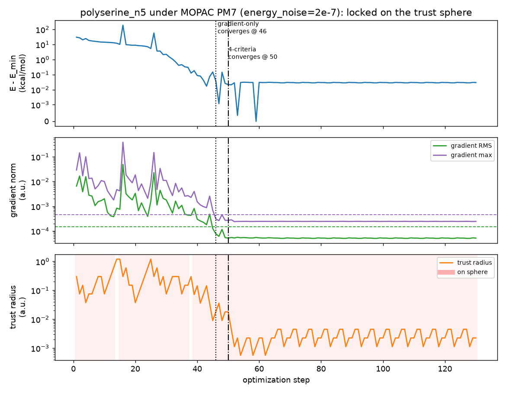
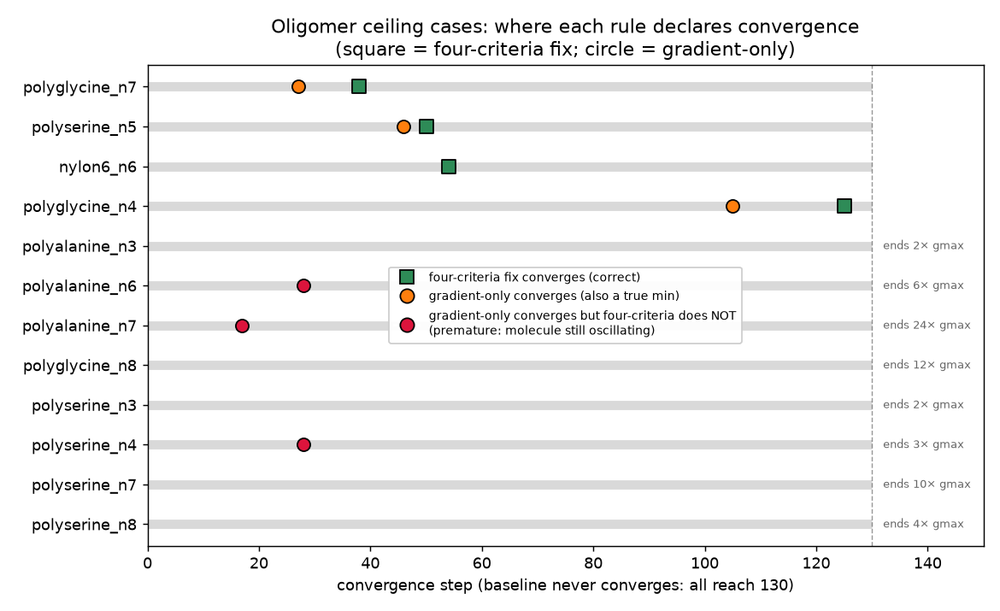

# The sphere-restricted convergence gate: false negatives at noisy flat minima

## Motivation

Issue #129 (from the #128 oligomer-benchmark dissection) identifies the
`Minimization on sphere` convergence gate as the proximate cause of about
half the unconverged MOPAC PM7 runs in the oligomer benchmark. When the
quadratic step is truncated to the trust-region sphere, `is_converged`
(`src/berny/berny.py`) used to replace the two displacement criteria with a
single hard-coded `('Minimization on sphere', False)`, so a run **could not**
be declared converged while pinned to the sphere — no matter how small the
gradient was.

For floppy, hydrogen-bonding chains near a *noisy, flat* PM7 minimum the
trust radius collapses and re-expands in a sawtooth (PM7 energy noise drives
Fletcher's predicted-vs-actual ratio haywire), which keeps the step on the
sphere indefinitely. The optimizer then burns its entire step budget on an
already-converged structure.

This experiment (1) reproduces the false negative, (2) tests the two fixes
proposed in #129 against the optimizer's *actual* behaviour, and (3) checks
for regressions on the bundled `birkholz` and `baker` MOPAC benchmarks.

## The bug, and a three-way contradiction

The old gate:

```python
criteria = [('Gradient RMS', ...), ('Gradient maximum', ...)]
if on_sphere:
    criteria.append(('Minimization on sphere', False))   # hard block
else:
    criteria.extend([('Step RMS', ...), ('Step maximum', ...)])
```

Three sources of truth disagreed about what *should* happen on a sphere step:

| Source | Behaviour on a sphere-restricted step |
|---|---|
| **The code** (`is_converged`) | hard-blocked — never converges |
| **The docs** (`doc/standard_method.rst`) | "skips the step-based criteria and demands the gradient-based criteria only" |
| **The SM itself** (Birkholz–Schlegel / Gaussian) | all four criteria, the displacement ones tested against the *actual* step taken |

The fix shipped alongside this experiment makes the code follow the SM: the
four standard criteria are always tested, with the displacement criteria
evaluated against the actual (trust-limited) step. On a *wide-trust* sphere
step the displacement is large and fails by construction — exactly the SM
intent that a converged minimum sit at an interior step. On a
*collapsed-trust* sphere step (the noisy-minimum case) the displacement is
tiny and the four criteria are genuinely met, so the run converges.

## Method

- MOPAC PM7, `Berny(maxsteps=130, energy_noise=2e-7)` — the same settings the
  benchmark harness uses for MOPAC (`scripts/benchmark.py`).
- Geometries: the [ghutchis/oligomer-benchmarks](https://github.com/ghutchis/oligomer-benchmarks)
  set wired up in #127 (the 14 ceiling cases catalogued in #128), plus the
  bundled `birkholz` (19) and `baker` (30) sets for the regression check.
- Per-step structured traces via `Berny(trace=...)`.

**Why counterfactual analysis on baseline traces is exact here.** Both
candidate fixes change *only* the return value of `is_converged`; they touch
no step computation. The optimization trajectory — geometries, Hessian, trust
radius, everything — is therefore *identical* to baseline up to the step where
a fix first declares convergence. Reading the baseline traces thus predicts,
exactly, the step at which each candidate would stop. We confirmed this
end-to-end: the patched four-criteria optimizer stops `polyserine_n5` at step
50, bit-for-bit the step the baseline trace predicts.

Two candidates from #129 were compared:

- **gradient-only** — on a sphere step require only the two gradient criteria
  (what the docs claimed PyBerny already did).
- **four-criteria** — always test all four, displacement against the actual
  step (the fix shipped here).

## Results

### 1. The false negative is real



`polyserine_n5` is the clean, reproducible case. After ~step 46 the energy is
pinned at its minimum and **both** gradient norms sit below their thresholds
for the rest of the run, but the trust radius sawtooths (collapse → regrow →
collapse) and keeps **98 %** of steps on the sphere. Baseline therefore never
converges and spends all 130 steps on an already-converged structure. The
four-criteria fix converges at **step 50** (gradient-only at 46) — a ~2.6×
reduction in work for an identical result.

### 2. Four-criteria converges true minima and rejects oscillators — gradient-only does not



Of the 14 ceiling cases, two (`nylon6_n7`, `nylon6_n8`) hit the brittle MOPAC
gradient-parser bug (the `KCAL/ANGSTROM` `ValueError` documented in #128) and
are excluded. On the remaining 12:

- **four-criteria converges 4** — `polyserine_n5` (50), `polyglycine_n7` (38),
  `nylon6_n6` (54), `polyglycine_n4` (125) — each at a step where all four
  criteria genuinely hold.
- **It correctly leaves 8 at the ceiling.** These never satisfy the gradient
  criteria (they end 2–12× over the max-gradient threshold): genuinely
  oscillating between conformers, the separate hard problem #128/#129 flag as
  out of scope.
- **gradient-only would prematurely "converge" 3 oscillators** —
  `polyalanine_n7` (step 17, ends **24×** over the gradient-max threshold),
  `polyalanine_n6` (28, ends 6×), `polyserine_n4` (28, ends 3×). Their
  gradient momentarily dips below threshold on a *large* on-sphere step while
  the molecule is still moving a long way. The displacement criteria block
  exactly these.

This is the decisive result: the displacement criteria are what separate
"settled at a minimum" from "passing through with a small instantaneous
gradient on a big step." Dropping them — the gradient-only rule the docs
described — is unsafe. Keeping them, evaluated against the actual step, is the
literal SM and is what the shipped fix does.

### 3. Regression check on the bundled benchmarks

The counterfactual was run over all 19 `birkholz` + 30 `baker` molecules
(same MOPAC PM7 settings). The four-criteria fix is essentially invisible
here:

| Set | molecules | four-criteria changes vs baseline | gradient-only changes vs baseline |
|---|---:|---|---|
| `baker` | 30 | **0** | 4 (all earlier/premature) |
| `birkholz` | 19 | **1 — a recovery** | 9 (all earlier/premature) |

- **`baker`: every molecule converges at the exact same step** as baseline.
- **`birkholz`: the single change is a *gain*** — `raffinose`, a documented
  non-converger (`mopac_pm7_steps: null`), now converges at step 97 (final
  gradient 0.07× the max threshold) instead of burning all 130 steps on the
  sphere. No molecule converges earlier or stops converging, so no reference
  step counts need reseeding.

The gradient-only rule, by contrast, would converge 13 benchmark molecules
**earlier** — `bisphenol_a` 46→11, `benzidine` 26→8, `azadirachtin` 66→38,
`tamoxifen` 72→44, … — each on a wide on-sphere step where the gradient
momentarily dips while the optimizer is still taking a large step. That both
changes reference step counts and risks declaring convergence away from the
settled minimum, exactly the failure the oligomer set makes stark.

This is the safety argument made concrete: the four-criteria fix changes
behaviour **only** at collapsed-trust noisy minima (the bug), leaving the
well-behaved benchmarks bit-for-bit unchanged.

## Conclusions

1. **The hard-block is a deviation from the SM and the proximate cause of the
   false negatives.** The shipped fix replaces it with the literal four-criterion
   test (displacement against the actual step), resolving the
   `polyserine_n5`-style false negatives.
2. **Four-criteria beats gradient-only.** Gradient-only (what the docs
   described) prematurely converges oscillating molecules whose gradient
   momentarily dips on a wide on-sphere step. The displacement test prevents
   this.
3. **The fix cannot converge earlier than the SM standard allows.** On a
   wide-trust sphere step it behaves exactly like the old hard-block (the
   displacement criteria fail). It changes behaviour *only* at collapsed-trust
   noisy minima — precisely the bug — so it is safe by construction, which the
   benchmark regression check confirms.
4. **Out of scope (real, separate problems).** The genuine conformer-oscillation
   cases (recurrent negative Hessian eigenvalue) are a harder optimization
   problem, not a thresholding artefact. The trust-radius sawtooth itself
   (#129 direction 2: damp the collapse near a noisy flat minimum) would cut
   the *wasted* steps before convergence, but it is a trajectory-changing
   controller change with broader risk; the convergence-gate fix resolves the
   false negatives on its own and is the minimal, safe change. The MOPAC
   gradient-parser fragility (`nylon6_n7/n8`) is a solver-interface bug,
   tracked separately.

## Reproduction

Clone [ghutchis/oligomer-benchmarks](https://github.com/ghutchis/oligomer-benchmarks),
then for each molecule run `Berny(geom, maxsteps=130, energy_noise=2e-7)`
against `berny.solvers.MopacSolver` (PM7) with `trace=<path>`. From each
baseline trace, the convergence step of a candidate rule is the first step
whose `convergence.criteria` satisfy that rule (gradient-only: the two
gradient entries; four-criteria: all four, with the step criteria read from
`total_step`). The `birkholz`/`baker` regression is the same counterfactual
over the bundled sets via `berny.benchmarks.iter_molecules`. Needs `mopac` on
`$PATH`; the full sweep is ~30 min single-threaded. The two figures here are
the record of the run; the driver and raw traces are not committed.
