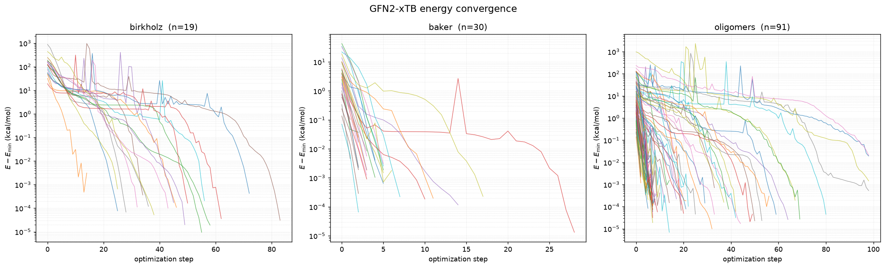
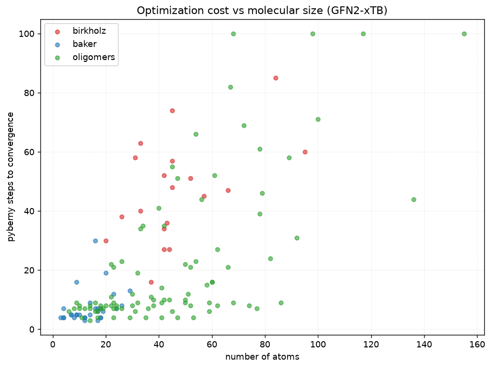
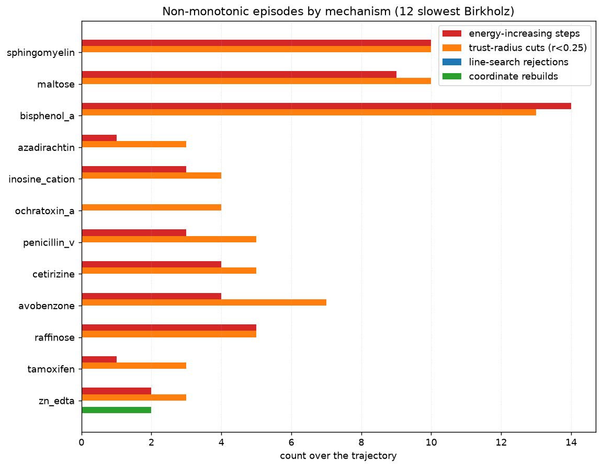

# GFN2-xTB energy-convergence behaviour across the three benchmarks

## Motivation

Issue [#110] proposed a quantitative study of PyBerny's energy-convergence
behaviour on the Birkholz and Baker reference sets, prompted by the combined
convergence figures produced in CI. That issue was written when the benchmark
runner was **MOPAC**, and it called out three worrying features of those plots:
long step-count tails on large flexible Birkholz molecules, sharp *upward*
energy spikes mid-run (hypothesised to come from coordinate rebuilds or
RFO/line-search overshoot), and — most surprising — small Baker molecules with
persistent tails out to 70–80 steps despite very few degrees of freedom.

The runner is now **GFN2-xTB** (via `tblite`, see commit history around the
`XTBSolver` backend), and there is a third benchmark, `oligomers` (length
series of common polymers, 91 systems). This experiment repeats the #110
analysis under xTB across all three sets — steps-to-convergence, non-monotonic
attribution, cost-vs-size, and agreement with the recorded reference step
counts — dropping the MOPAC-specific parts.

## Method

All three benchmarks were run locally with the default GFN2-xTB backend:

```bash
git submodule update --init external/oligomer-benchmarks   # oligomers geometries
for b in birkholz baker oligomers; do
  python scripts/benchmark.py --benchmark "$b" --solver xtb \
    --out-json "results/xtb-$b-all.json" --out-trace-dir "results"
done
```

`--out-trace-dir` writes the structured per-step optimizer trace
(`berny.Berny(trace=...)`) for every molecule. Each record carries the current
energy, `coord_rebuild`, the `trust_update` (Fletcher's parameter `r` and the
new trust radius), the `linear_search` outcome (`none-best` = step rejected back
to the best point), and the `quadratic_step` (negative-eigenvalue count). That
is everything needed to attribute the non-monotonic episodes to a mechanism
rather than guessing. The figures below are built from those traces and the
`xtb_gfn2_steps` baselines in each set's `reference.json` (the same values the
CI regression gate uses).

Note that GFN2-xTB step counts are not bitwise-reproducible across machines
(see `src/berny/benchmarks/birkholz_schlegel/SOURCE.md`), so the absolute counts
here can differ by a step or two from any single CI run; the qualitative
findings and the reference agreement below do not depend on that.

## Results

### Steps to convergence

| set | n | converged | min | median | max | slowest system |
|---|---:|---:|---:|---:|---:|---|
| birkholz  | 19 | 19/19 | 16 | 47 | 85  | `sphingomyelin` (85) |
| baker     | 30 | 30/30 |  3 |  5 | 30  | `achtar10` (30) |
| oligomers | 91 | 86/91 |  3 |  9 | 100 | 4 systems hit the cap |



**Birkholz** all converge. The slowest are the large/flexible sugars and
lipids the original issue flagged (`sphingomyelin`, `maltose`, `bisphenol_a`,
`ochratoxin_a`), but the tails are shorter and better-behaved than the MOPAC
picture: everything is in within ~85 steps.

**Baker is the headline change.** The #110 worry — small molecules tailing to
70–80 steps — is simply gone under xTB. The median is **5** steps and the
single slowest system (`achtar10`, 16 atoms) needs 30. Whatever produced those
long small-molecule tails was a MOPAC-surface / runner artifact, not a
coordinate-system or symmetry problem in the optimizer.

**Oligomers** are the new stress test. 86/91 converge; the five that don't
split into two distinct causes:

- Four long, floppy chains — `nylon6_n5`, `nylon6_n6`, `nylon6_n8`,
  `polyglycine_n8` — hit the `maxsteps = 100` cap. These are genuine
  slow-converging cases: very many soft torsional DOF on a near-flat surface.
- `PPE_n8` is **not** an optimizer failure at all — the GFN2-xTB *SCF* fails to
  converge in 250 cycles (`TBLiteRuntimeError`). That is an electronic-structure
  failure in the solver, and should be counted separately from optimizer
  non-convergence.

### Cost vs. structure



Step count rises with system size but only loosely: Pearson *r* = 0.67 overall,
0.50 within Birkholz, 0.67 within the oligomer length series (where size is the
main thing that varies), and just 0.32 within Baker. Size sets a floor, but
flexibility (torsional DOF, H-bonding chains) is what produces the slow tails —
the four capped oligomers are mid-sized (68–155 atoms) nylon/polyglycine
chains, not the largest systems, and the 136-atom `decacene` converges in 44.

### Non-monotonic episodes are trust-region overshoot, not rebuilds

The upward energy spikes #110 noticed are real and present under xTB too
(7.1% of Birkholz steps, 3.6% of Baker, 10.4% of oligomer steps increase the
energy). The trace pins the mechanism unambiguously:

**274 of 279 energy-increasing steps (98%) coincide with a trust-radius cut**
(Fletcher's `r < 0.25`, which shrinks the next trust radius to `‖Δq‖/4`).

In other words the spikes are ordinary RFO/trust-region *overshoot*: a step
lands above the quadratic prediction, the trust update catches it (`r < 0.25`)
and contracts, and the surface is recovered within a step or two. The competing
hypotheses from the issue do **not** drive these episodes:

- **Coordinate rebuilds** are almost never involved — only **7 rebuilds across
  all 140 molecules** (3 Birkholz, 1 Baker, 3 oligomers), and they are the
  linear-bend topology rebuilds (e.g. the near-linear Si–O–Si in
  `disilyl_ether`), not a recurring source of energy jumps.
- **Line-search rejections** (`none-best`, returning to the best point) are
  essentially absent (a single occurrence, in `nylon6_n6`).



The per-system breakdown makes the one-to-one relationship visible: the
energy-increasing-step bar tracks the trust-cut bar for every molecule, while
the line-search-rejection and coordinate-rebuild bars are flat at zero (the lone
exception being two rebuilds on `zn_edta`). Individual overshoots can be large
in magnitude (hundreds to a few thousand kcal/mol above the eventual minimum)
but they are transient single-step excursions that are damped immediately, not a
sign of the optimizer getting lost.

### Agreement with the reference step counts

Where a system has a seeded `xtb_gfn2_steps` baseline, PyBerny reproduces it
tightly. The largest deviations are `nylon6_n4` (+3) and a couple of ±2 cases
(`sphingomyelin`, `polyserine_n7`); everything else is within ±1, and the
Baker set matches its baseline exactly across all 30 systems. There is no
systematic regression on any particular system. (The Birkholz–Schlegel "paper"
SM step counts are at HF/B3LYP, a different surface from GFN2-xTB, so they are
not directly comparable to these counts and are not used as a gate.)

## Conclusions

Under GFN2-xTB the optimizer behaves substantially better than the MOPAC
snapshot in #110:

1. The surprising slow-small-molecule Baker tails are gone (median 5 steps);
   they were a MOPAC artifact, not an optimizer coordinate/symmetry problem.
2. The mid-run upward energy spikes are benign trust-region overshoot — 98% of
   them coincide with a Fletcher `r < 0.25` trust cut and recover immediately.
   Coordinate rebuilds and line-search rejections are *not* the cause.
3. Cost scales with size only loosely (overall *r* = 0.67); flexibility, not
   raw atom count, drives the slow tails.
4. The only genuine non-convergences are four long floppy oligomer chains that
   hit the 100-step cap, plus one oligomer (`PPE_n8`) whose *SCF* fails — an
   electronic-structure failure that should be tallied apart from optimizer
   non-convergence.
5. Measured step counts track the recorded `xtb_gfn2_steps` references within a
   step or two, with no system-specific regression.

[#110]: https://github.com/jhrmnn/pyberny/issues/110
