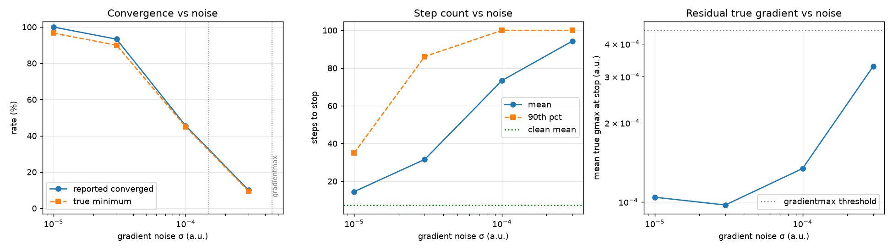
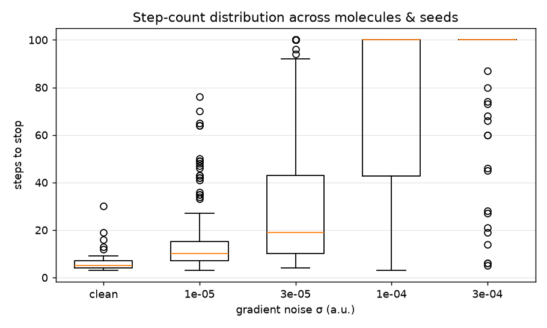

# Baker benchmark: convergence stability under gradient noise

**Benchmark:** baker (30 molecules) &nbsp;·&nbsp;
**Solver:** GFN2-xTB (tblite) &nbsp;·&nbsp;
**Noise model:** additive Gaussian on gradients (a.u.), energy clean &nbsp;·&nbsp;
**Seeds/level:** 6 &nbsp;·&nbsp; **maxsteps:** 100

pyberny's convergence test fires when the gradient max/RMS fall below
`gradientmax = 4.50e-04` / `gradientrms = 1.50e-04`
(a.u.). Each optimization step the clean tblite gradient is perturbed by
additive Gaussian noise `N(0, σ²)` before being fed to the optimizer; the
energy is left clean so the experiment isolates the effect of *gradient* error.

## Aggregate stability vs noise level

| Gradient noise σ (a.u.) | Runs | Converged | Mean steps | Median steps | False conv.* | Mean true gmax | Mean RMSD vs clean (Å) |
|---|---:|---:|---:|---:|---:|---:|---:|
| 0 (clean) | 30 | 100% | 7.4 | 5 | 0% | 2.17e-04 | 0.000 |
| 1e-05 | 180 | 100% | 14.5 | 10 | 3% | 1.04e-04 | 0.021 |
| 3e-05 | 180 | 93% | 31.6 | 19 | 3% | 9.72e-05 | 0.019 |
| 1e-04 | 180 | 46% | 73.4 | 100 | 1% | 1.34e-04 | 0.015 |
| 3e-04 | 180 | 10% | 94.4 | 100 | 1% | 3.28e-04 | 0.000 |

\* **False convergence** = pyberny reported convergence but the *true* (clean)
gradient max at the stopping geometry still exceeds `gradientmax`. The
"true minimum" curve in the plot is the reported rate minus this.

## Per-molecule convergence rate (most robust first)

Cells are the fraction of seeds that reported convergence at each σ.

| Molecule | Atoms | Clean steps | σ=1e-05 | σ=3e-05 | σ=1e-04 | σ=3e-04 |
|---|---:|---:|---:|---:|---:|---:|
| ammonia | 4 | 4 | 100% | 100% | 100% | 100% |
| water | 3 | 4 | 100% | 100% | 100% | 100% |
| acetylene | 4 | 4 | 100% | 100% | 100% | 50% |
| hydroxysulfane | 4 | 7 | 100% | 100% | 100% | 50% |
| acetone | 10 | 5 | 100% | 100% | 100% | 0% |
| allene | 7 | 5 | 100% | 100% | 100% | 0% |
| benzene | 12 | 3 | 100% | 100% | 100% | 0% |
| difluorobenzene_13 | 12 | 4 | 100% | 100% | 100% | 0% |
| ethane | 8 | 4 | 100% | 100% | 100% | 0% |
| ethanol | 9 | 5 | 100% | 100% | 100% | 0% |
| furan | 9 | 5 | 100% | 100% | 100% | 0% |
| methylamine | 7 | 5 | 100% | 100% | 100% | 0% |
| trifluorobenzene_135 | 12 | 4 | 100% | 100% | 100% | 0% |
| disilyl_ether | 9 | 16 | 100% | 100% | 50% | 0% |
| hydroxybicyclopentane_2 | 14 | 9 | 100% | 100% | 17% | 0% |
| achtar10 | 16 | 30 | 100% | 100% | 0% | 0% |
| benzaldehyde | 14 | 5 | 100% | 100% | 0% | 0% |
| caffeine | 24 | 7 | 100% | 100% | 0% | 0% |
| difluoronaphthalene_15 | 18 | 4 | 100% | 100% | 0% | 0% |
| difuropyrazine | 16 | 7 | 100% | 100% | 0% | 0% |
| histidine | 20 | 19 | 100% | 100% | 0% | 0% |
| mesityl_oxide | 17 | 6 | 100% | 100% | 0% | 0% |
| naphthalene | 18 | 4 | 100% | 100% | 0% | 0% |
| neopentane | 17 | 3 | 100% | 100% | 0% | 0% |
| pterin | 17 | 7 | 100% | 100% | 0% | 0% |
| trisilacyclohexane_135 | 18 | 7 | 100% | 100% | 0% | 0% |
| acanil01 | 19 | 6 | 100% | 83% | 0% | 0% |
| dimethylpentane | 23 | 12 | 100% | 50% | 0% | 0% |
| menthone | 29 | 13 | 100% | 50% | 0% | 0% |
| benzidine | 26 | 8 | 100% | 17% | 0% | 0% |

*Total wall time for the sweep: 3181 s.*
